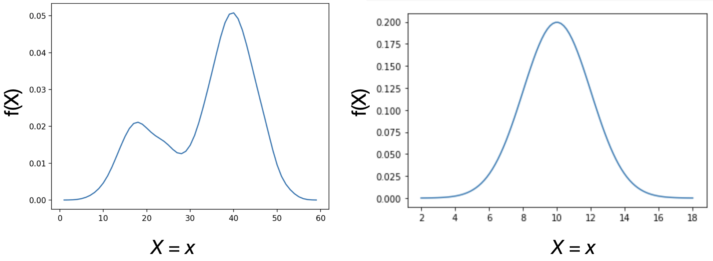
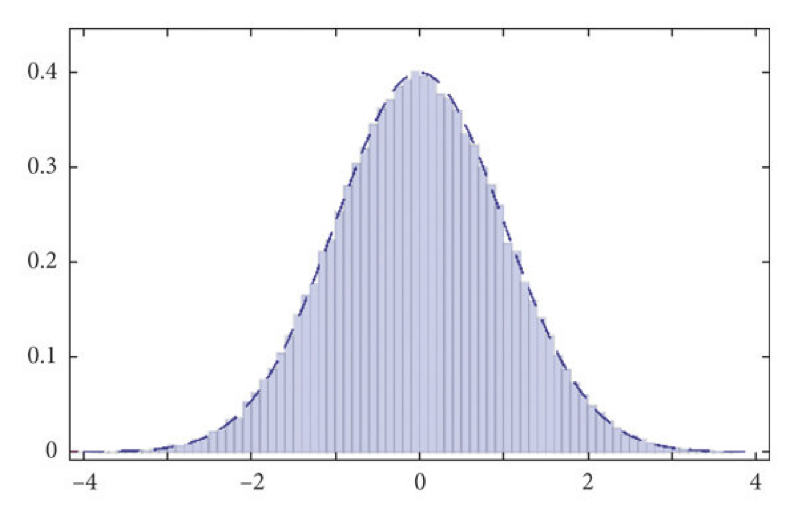
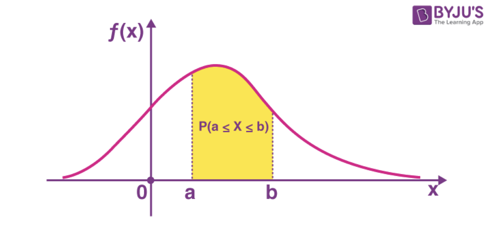
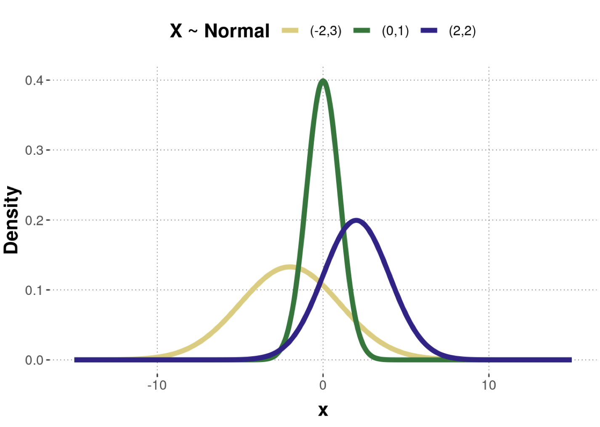
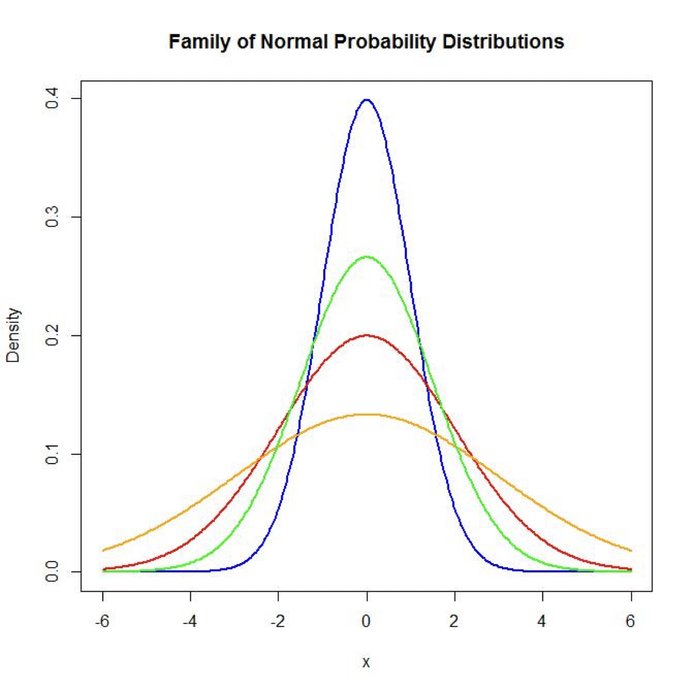
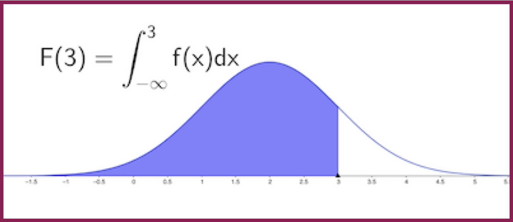
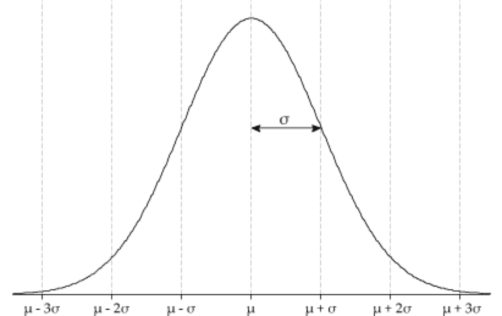
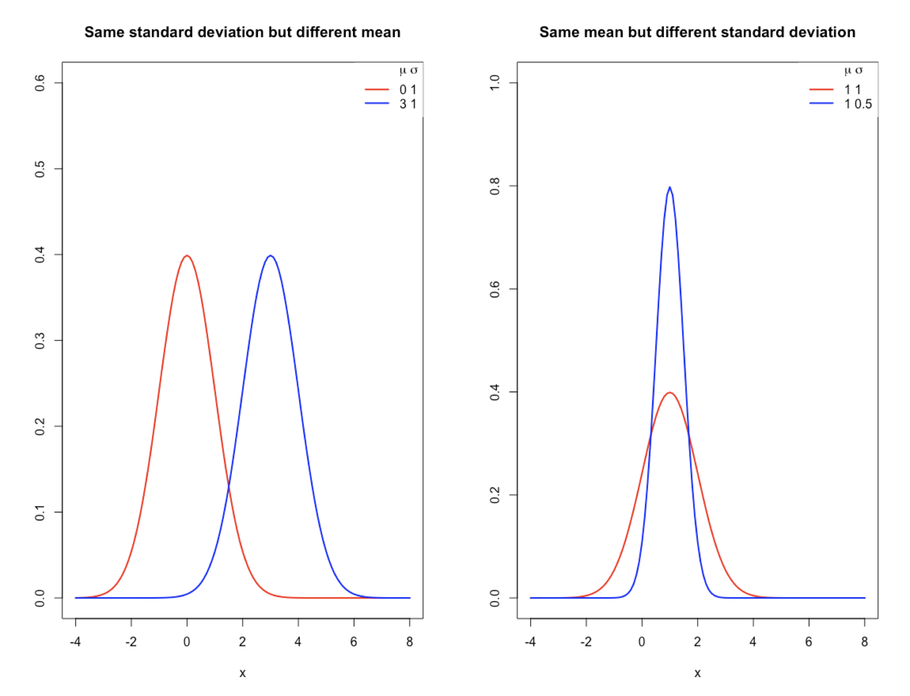
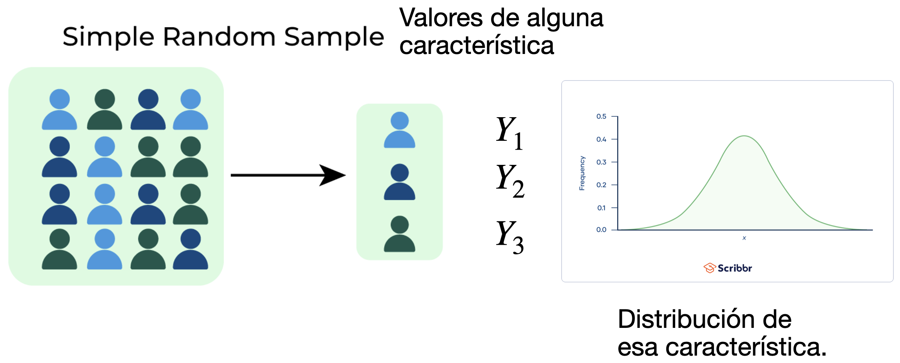

## Agenda

</br>

- Introducción

- Distribución Normal

- Teorema del Límite Central

## Carguemos las librerías

</br></br></br>

Antes de empezar, carguemos las librerías que usaremos hoy.

```{python}
#| echo: true
#| output: true

import pandas as pd
import matplotlib.pyplot as plt
import seaborn as sns
from scipy.stats import norm
```

En el cógido de arriba, indicamos que utilizaremos la función `norm()` de la librería **scipy.stats** para calcular probabilidades.

## Introducción

</br>

Una variable aleatoria es [**continua**]{style="color: darkblue"} si puede tomar un número infinito de valores reales posibles.

. . . 

Por ejemplo,

::: incremental
- La cantidad de lluvia en un área específica.

- El rendimiento de un antibiótico en un proceso de fermentación.

- La duración de vida de una lavadora.
:::

## Función de densidad

Una función importante para variables aleatorias continuas es la función de densidad de probabilidad.

. . . 

</br>

La [**función de densidad de probabilidad**]{style="color: #4682B4"} de una variable aleatoria continua $X$ es la función $f(x)$ tal que

- $f(x) \geq 0$ para todos los valores de $x$, $-\infty < x < \infty.$

- $\int_{-\infty}^\infty f(x)dx =1.$

. . . 

La función de densidad de probabilidad se usa para **calcular probabilidades**.

## Ejemplos de funciones de densidad

</br></br>

{fig-align="center"}

## Función de densidad como aproximación al histograma de una población

{fig-align="center"}

## Calculando probabilidades

</br></br>

Considera una variable aleatoria continua $X$ con función de densidad $f(x)$. 

</br>

Si $a$ y $b$ son dos números ($a>b$) entonces

::: {style="font-size: 87%;"}
$$P(a\le X \le b)= P(a \le X < b) = P(a<X\le b)= \int
_{a}^b f(x) dx.$$
:::

##

</br></br>

Además

$$P(X\le a)= P(X < a) = \int_{-\infty}^af(x)dx$$

$$P(X\ge a)= P(X > a) = \int_{a}^{\infty}f(x)dx$$

## 

</br></br>

La probabilidad es el [**área bajo la curva**]{style="color: purple"} creada por $f(x)$

{fig-align="center"}

## 

Si $Y$ es una [**variable aleatoria continua**]{style="color: #4682B4"}, entonces, para cualquier número $y_0$,

$$P(Y = y_0) = 0.$$

. . . 

Dos explicaciones:

::: incremental
- El área debajo de la curva y entre $y_0$ y $y_0$ no tiene ancho y, por lo tanto, no tiene área. Como la probabilidad es igual al área, la probabilidad es cero.

- Si $Y$ es, digamos, una medida de lluvia diaria, la probabilidad de que sea exactamente 2.193478 pulgadas es cero.
:::

## Valor esperado

</br></br>

El [**promedio teórico**]{style="color: #5E7D6A"} o [**valor esperado**]{style="color: #5E7D6A"} de una variable aleatoria continua $X$ es

$$E(X) = \int_{-\infty}^\infty x f(x)dx$$

Esto es similar al valor esperado de una variable aleatoria discreta.

## 

El valor esperado define la locación del centro de la función de densidad.

{fig-align="center"}

## Varianza y desviación estándar

</br></br>

La [**varianza teórica**]{style="color: #5E7D6A"} de una variable aleatoria continua $X$ es

$$V(X) = E\left[ (X - \mu)^2 \right] = \int_{-\infty}^\infty (x-\mu)^2f(x)dx,$$

donde $\mu = E(X)$.

</br>

La [**desviación estándar**]{style="color: #5E7D6A"} de $X$ es la raíz cuadrada de $V(X)$.

##

</br></br>

La desviación estándard define la ***dispersión*** de la función de densidad.

{fig-align="center"}


## Más sobre variables aleatorias continuas

Sea $X$ una variable aleatoria continua con una función de densidad $f(x)$. La [**función de distribución acumulada**]{style="color: darkblue"} de $X$ es

$$F(x)=P(X\le x)= \int_{-\infty}^xf(t)dt.$$


{fig-align="center" width="248"}

# Distribución Normal

## Introducción

La [**distribución normal**]{style="color: #4682B4"} (también llamada **distribución gaussiana**) es la distribución más utilizada en estadística.

La distribución tiene la familiar forma de campana y proporciona un buen modelo para muchas, aunque no todas, las poblaciones continuas.

. . . 

Aplicaciones:

- Diseño experimental.

- Control de calidad.

- Modelado estadístico.

## Distribución Normal


La distribución normal tiene **dos parámetros**: $\mu$ y $\sigma$. Aquí, $\mu$ puede ser cualquier número y $\sigma$ puede ser cualquier número positivo.

La función de [**densidad de probabilidad**]{style="color: #4682B4"} de una distribución normal con media $\mu$ y varianza $\sigma^2$ está dada por

$$f(x)= \frac{1}{\sigma\sqrt{2 \pi}} e^{\frac{-(x-\mu)^2}{2\sigma^2}},\; -\infty<x<\infty.$$

Si $X$ sigue una distribución normal con media $\mu$ y varianza $\sigma^2$, escribimos $X\sim{N(\mu,\sigma^2)}$.


##

</br></br>

{fig-align="center"}


## Media y varianza

</br></br>

Si $X\sim{N(\mu,\sigma^2)}$, entonces

- El promedio teórico de $X$ es $\mu$.

- La varianza teórica de $X$ es $\sigma^2$.

- La desviación estándar teórica de $X$ es $\sigma$.

## Efecto de los parametros

::::: columns
::: {.column width="45%"}
::: {style="font-size: 90%;"}
- Debemos de pensar en $N(\mu,\sigma^2)$ como una [*familia*]{style="color: #5E7D6A"} de distribuciones.

- Cada miembro de esa familia tiene una combinación de valores para los parámetros $\mu$ y $\sigma^2$.

- Cada miembro tiene una función de probabilidad diferente.
:::
:::

::: {.column width="55%"}
</br>

{fig-align="center"}
:::
:::::

## Encontrar áreas bajo la curva

</br>

- El calculo de probabilidades usando la distribución normal necesita la integral de la función de densidad normal.

- Sin embargo, esta integral no tiene una solución en forma cerrada.

- En lugar de eso, se usan algoritmos de aproximación para realizar los cálculos.

- En la práctica, los calculos de probabilidades se hacen usando software estadístico como Minitab, JMP, R, o Python.

## Calculo de probabilidades en Python


Consideremos una máquina que envasa arroz dentro de cajas. El proceso sigue una distribución Normal y se sabe que la media del peso de cada caja es 1000 gramos y la desviación estándar es 10 gramos.

::: {style="font-size: 83%;"}
A. Calcula la probabilidad de obtener una caja que pese menos de 1010 gramos. $P(X < 1010) = P(X \leq 1010)$.

B. Calcula la probabilidad de obtener una caja que pese más de 980 gramos. $P(X > 980) = P(X \geq 980)$.

C. Calcula la probabilidad de obtener una caja que pese más de 990 gramos y menos de 1000 gramos. $P(X < 1000) - P(X <990) = P(X \leq 1000)−P(X \leq 990)$. 
:::


## Primero...

</br></br></br>

Definamos los valores apropiados para $\mu$ y $\sigma$ en Python.

```{python}
#| echo: true
#| output: true

m = 1000 # Media de la distribución normal.
s = 10 # Desviación estándard de la distribución normal.
```

##

</br>

**A**. Calcula la probabilidad de obtener una caja que pese menos de 1010 gramos. $P(X < 1010) = P(X \leq 1010)$.

</br>

Para calcular la probabilidad de que una variable Normal ($X$) tome un **valor menor (o igual)** a $k$ usamos la función `norm.cdf(k, loc, scale)`. En este caso,  `loc` y `scale` especifican los valores de $\mu$ y $\sigma$, respectivamente

```{python}
#| echo: true
#| output: true

k = 1010
prob = norm.cdf(k, loc = m, scale = s)
print(f"P(X <= {k}) = {prob:.4f}")
```

##

**B**. Calcula la probabilidad de obtener una caja que pese más de 980 gramos. $P(X > 980) = P(X \geq 980)$.

Para calcular la probabilidad de que una variable Normal ($X$) tome un **valor mayor (o igual)** a $k$ usamos la función `norm.sf(k, loc, scale)`.

```{python}
#| echo: true
#| output: true

k = 980
prob_mas_de = norm.sf(k, loc = m, scale = s)
print(f"P(X > {k}) = {prob_mas_de:.4f}")
```

. . . 

Alternativamente, por reglas de probabilidad, podemos usar el siguiente código:

```{python}
#| echo: true
#| output: true

print(1 - norm.cdf(k, loc = m, scale = s))
```

Que se traduce en $P(X > k) = 1 - P(X \leq k)$.

##

**C**. Calcula la probabilidad de obtener una caja que pese más de 990 gramos y menos de 1000 gramos. 

Para este caso, tenemos que

::: {style="font-size: 90%;"}
$$P(X < 1000) - P(X <990) = P(X \leq 1000)−P(X \leq 990).$$
:::

. . . 

</br>

En Python, esto se logra con `norm.cdf()` como sigue:

```{python}
#| echo: true
#| output: true

k_superior = 1000
k_inferior = 990

prob = norm.cdf(k_superior, loc = m, 
                scale = s) - norm.cdf(k_inferior - 1, 
                loc = m, scale = s)
print(f"P({k_inferior} <= X <= {k_superior}): {prob:.4f}")
```


## Regla Empirica

{fig-align="center"}

::: {style="font-size: 80%;"}
Considera una población que sigue una distribución normal con media $\mu$ y desviación estándar $\sigma$. Nota que la curva es simétrica con respecto a $\mu$.

Alrededor del 68% de la población se encuentra en el intervalo $[\mu - \sigma, \; \mu + \sigma]$.

Aproximadamente el 95% de la población se encuentra en el intervalo $[\mu - 2\sigma, \; \mu + 2\sigma]$.

Aproximadamente el 99.7% de la población se encuentra en el intervalo $[\mu - 3\sigma, \; \mu + 3\sigma]$.
:::

## Unidades estándar

</br>

La proporción de una población normal que se encuentra dentro de un número determinado de desviaciones estándar de la media es la misma para cualquier población normal.

Por esta razón, cuando se trata de poblaciones normales, a menudo convertimos las unidades en las que se midieron originalmente los elementos de la población a [**unidades estándar**]{style="color: #B2AC88"}.

Las unidades estándar indican cuántas desviaciones estándar tiene una observación de la media poblacional.

## Distribución Normal Estándar

</br>

En general, convertimos a unidades estándar restando la media y dividiéndola por la desviación estándar.

Entonces, si $X\sim{N(\mu,\sigma^2)}$, la unidad estándar de $X$ es el siguiente número:

$$Z=\frac{X-\mu}{\sigma}.$$

. . . 

La distribución de $Z$ es normal con media 0 y desviación estándar 1. Esta distribución se llama [**distribución normal estándar**]{style="color: #B2AC88"}.

## Calculo de probablidades 

</br></br>

Si $X \sim N(\mu, \sigma^2)$ y $x_0$ es una constante, tenemos que

$$P(X > x_0) = P \left( \frac{X-\mu}{\sigma} > \frac{x_0-\mu}{\sigma}\right) = P \left( Z > z_0\right),$$

donde $Z \sim N(0, 1)$ y la constante $z_0 = \frac{x_0-\mu}{\sigma}$ es el [*valor estandarizado*]{style="color: purple"} de $x_0$.

## 

</br></br></br>

Lo mismo para:

- $P(X < x_0) = P(Z < z_0)$
- $P(x_0 < X < x_1) = P(z_0 < Z < z_1)$ donde $z_1 = \frac{x_1-\mu}{\sigma}$.

## Propiedades de la distribución normal

- Si $X\sim{N(\mu,\sigma^2)}$ y tenemos las constantes $a \neq 0$ y $b$. Entonces

::: {style="text-align: center;"}
$aX + b \sim N(a \mu + b, a^2 \sigma^2)$
:::

. . . 

- Si $X$ y $Y$ son variables aleatorias [independentes]{style="color: #4682B4"} con $X\sim{N(\mu_X,\sigma^2_X)}$ y $Y\sim{N(\mu_Y,\sigma^2_Y)}$. Entonces

::: {style="text-align: center;"}
$X+ Y \sim N(\mu_X + \mu_Y, \sigma^2_X + \sigma^2_Y)$

$X -  Y \sim N(\mu_X - \mu_Y, \sigma^2_X + \sigma^2_Y)$
:::

## 

</br></br></br>

- Si $X_1, X_2, \ldots, X_n$ son variables aleatorias independentes y que siguen una distribución normal con media $\mu$ y varianza $\sigma^2$. Entonces,

$$\bar{X} =\sum_{i=1}^{n} \frac{X_i}{n} \sim N\left(\mu,\; \frac{\sigma^2}{n}\right)$$

# Teorema del Límite Central

## Muestra aleatoria

- Consideremos una muestra de $n$ observaciones seleccionadas aleatoriamente de una población.

- En estadística, los valores de esas observaciones se consideran variables aleatorias.

- Usamos $Y_i$ para la *i*-ésima observación y tenemos $n$ de ellas, $Y_1, \ldots, Y_n$.

- Se dice que todas las $Y_i$’s sigue una misma distribución específica. Además, asumimos que todas ellas son independientes.

## 

</br></br></br>

{fig-align="center"}

## Motivación

</br>

En muchas aplicaciónes, el resumen estadístico más importante es el promedio:

$$\bar{Y} = \frac{\sum_{i=1}^n Y_i}{n} = \frac{Y_1 + Y_2 + \cdots + Y_n}{n}$$

El teorema del limite central nos permite aproximar la distribución de $\bar{Y}$ [*sin importar la distribución*]{style="color: #5E7D6A"} de los valores individuales $Y_i$.

## Teórema del límite central

</br></br>

Si $Y_1, \ldots, Y_n$ es una muestra aleatoria que sigue [*una distribución*]{style="color: purple"} con un promedio teórico $\mu$ y una varianza teórica $\sigma^2$, entonces …

. . . 

[La distribución de $\bar{Y} = \frac{\sum_{i=1}^n Y_i}{n}$ converge a una distribución $N\left(\mu, \frac{\sigma^2}{n}\right)$ cuando el valor de $n$ es muy grande.]{style="color: #5E7D6A"}

## Aproximación a una distribución Binomial

::: incremental
- Considera una muestra $Y_1, Y_2, \ldots, Y_n$ de variables aleatorias Bernoulli con probabilidad $p$.

- Sabemos que el promedio teórico es $p$ y la varianza teórica es $p(1-p)$ para una distribución Bernoulli.

- Recuerda que si $X = Y_1 + \cdots + Y_n$, entonces $X \sim \text{Bin}(n,p)$.

- Gracias al teorema del límite central, podemos decir que

  - [$X \sim N(n p, np(1-p))$ cuando $n$ es muy grande.]{style="color: green"}


:::

## 

- [$X \sim N(n p, np(1-p))$]{style="color: green"}

Esta aproximación a la distribución binomial funciona bien cuando $n$ es grande y $p$ no está muy cerca de 0 ni de 1.

De hecho, cuando $n$ es grande, esta aproximación es la que se utiliza para calcular las probabilidades en una distribución binomial.

$$P(Y = y) = {n \choose y}p^y (1 -p)^{n -y}$$

Esto es debido a que es dificil calcular ${n \choose y}$ en este caso porque sus valores pueden ser muy grandes.

## Pregunta de práctica para examen

</br></br>

Los pesos de las langostas de Maine en el momento de su captura se distribuyen normalmente con una media de 1.8 lb y una desviación estándar de 0.25 lb.

¿Cuál es la probabilidad de que una langosta seleccionada al azar pese (a) entre 1.5 y 2 lb?, (b ) más de 1.55 lb?, (c) menos de 2.2 lb?

# [Return to main page](https://alanrvazquez.github.io/TEC-IN2032/)
