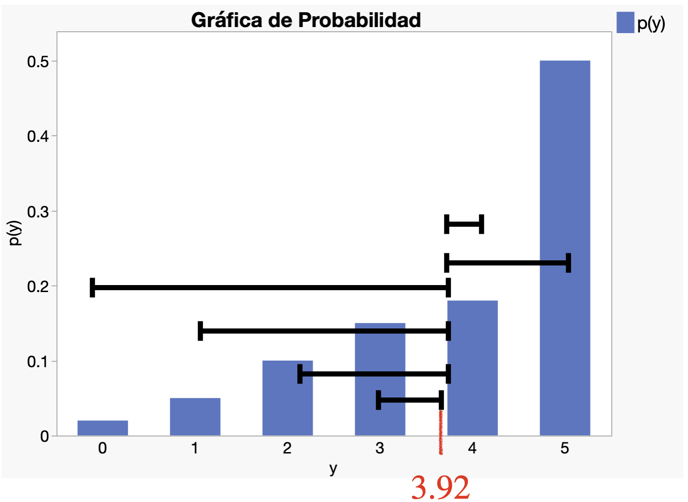
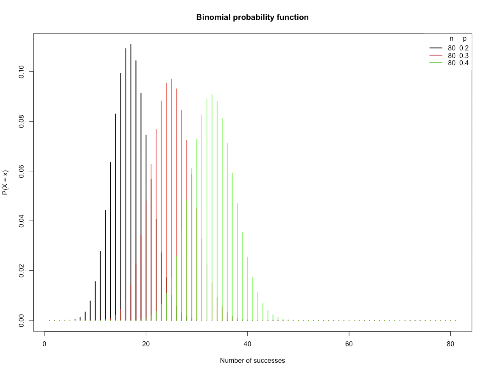

## Agenda

</br>

- Introducción

- Distribución de Bernoulli

- Distribución Binomial

## Una nueva librería: **scipy.stats**

::::: columns
::: {.column width="30%"}
</br>

{fig-align="left"}
:::

::: {.column width="70%"}
- **scipy.stats** es un módulo de la librería **SciPy** para realizar análisis estadístico en Python.
- Proporciona herramientas para trabajar con distribuciones de probabilidad, pruebas de hipótesis, intervalos de confianza y estadística descriptiva.
- Está construida sobre **numpy** para cálculos numéricos eficientes.
- <https://scipy.org/es/>
:::
:::::

## Carguemos las librerías

</br></br></br>

Antes de empezar, carguemos las librerías que usaremos hoy.

```{python}
#| echo: true
#| output: true

import pandas as pd
import matplotlib.pyplot as plt
import seaborn as sns
from scipy.stats import binom
```

En el cógido de arriba, indicamos que utilizaremos la función `binom()` de la librería **scipy.stats**.

# Introducción

## Variables Aleatorias Discretas

</br>

Una variable aleatoria es [**discreta**]{style="color: darkgreen"} si sólo puede asumir un número finito de valores distintos.

. . .

Por ejemplo,

::: incremental
- El número de bacterias por unidad de área.

- Número de piezas defectuosas en un envío de 100 piezas.

- El número de personas que están de acuerdo en una encuesta.
:::

## Notación

</br>

En lo que sigue, usaremos una letra mayúscula, como $Y$, para indicar una variable aleatoria.

</br>

Usaremos letras minúsculas, como $y$, para indicar un valor particular de la variable aleatoria.

</br>

Las expresiones $P(Y=y)$ y $p(y)$ denotan la probabilidad de que $Y$ tome el valor $y$.

## Función de probabilidad

</br>

La descripción de los posibles valores de $Y$ y las probabilidades de cada uno tiene un nombre: función de probabilidad.

</br>

La [**función de probabilidad**]{style="color: #4682B4"} de una variable aleatoria discreta $Y$ es la función

::: {style="font-size: 110%;"}
$$p(y) = P(Y=y).$$
:::

## 

</br></br>

Para cualquier función de probabilidad, debe cumplirse lo siguiente:

1.  $0 \leq p(y) \leq 1$ para todos los valores de $y$.
2.  $\sum_{y} p(y) = 1$, donde la suma es sobre todos los valores posibles de $y$.

## Ejemplo 1

</br>

Un hospital es conocido por el injerto de derivación de arteria coronaria. Sea $Y$ el número de estas cirugías realizadas en un día.

La siguiente tabla muestra la distribución de probabilidad de la variable aleatoria $Y$.

| $Y = y$ | 0    | 1    | 2    | 3    | 4    | 5    |
|---------|------|------|------|------|------|------|
| $p(y)$  | 0.02 | 0.05 | 0.10 | 0.15 | 0.18 | 0.50 |

## 

</br>

| $Y = y$ | 0    | 1    | 2    | 3    | 4    | 5    |
|---------|------|------|------|------|------|------|
| $p(y)$  | 0.02 | 0.05 | 0.10 | 0.15 | 0.18 | 0.50 |

</br>

La probabilidad de que se realicen 2 cirugías es $p(2) = 0.10$ o 10%.

La probabilidad de que se realicen 5 cirugías es $p(5) = 0.50$ o 50%.

Como es una distribución de probabilidad, tenemos que $p(0) + p(1) + p(2) + p(3) + p(4) + p(5) = 1$.

## 

</br>

| $Y = y$ | 0    | 1    | 2    | 3    | 4    | 5    |
|---------|------|------|------|------|------|------|
| $p(y)$  | 0.02 | 0.05 | 0.10 | 0.15 | 0.18 | 0.50 |

</br>

¿Cuál es la probailidad de que se realicen 6 cirugías?

. . .

$p(6) = 0$ ya que no forma parte de la distribución de probabilidad.

## Gráfica de probabilidad

Muestra las probabilidades para cada uno de los valores de una variable aleatoria.

```{python}
#| echo: true
#| output: true
#| fig-align: center
#| code-fold: true

variables = {
    "y": [0, 1, 2, 3, 4, 5],
    "p(y)": [0.02, 0.05, 0.10, 0.15, 0.18, 0.50]
}
datos = pd.DataFrame(variables)

# Crear la gráfica de barras
plt.figure(figsize=(8, 4))
sns.barplot(x="y", y="p(y)", data=datos, color="#4682B4")
plt.title("Distribución de Probabilidad $p(y)$")
plt.xlabel("Variable Aleatoria (Y)")
plt.ylabel("Probabilidad")
plt.ylim(0, 0.6) 
plt.show()
```

## Función de distribución acumulativa

</br></br>

La [**función de distribución acumulativa**]{style="color: purple"} especifica la probabilidad de que una variable aleatoria sea menor o igual a un valor dado.

La función de distribución acumulativa de la variable $Y$ es la función

::: {style="font-size: 110%;"}
$$F(y) = P(Y \leq y).$$
:::

## Ejemplo 1 (cont.)

</br>

| $Y = y$ | 0    | 1    | 2    | 3    | 4    | 5    |
|---------|------|------|------|------|------|------|
| $p(y)$  | 0.02 | 0.05 | 0.10 | 0.15 | 0.18 | 0.50 |

</br>

La probabilidad que el numero de cirugías en un día sea menor o igual a 2 es:

::: {style="font-size: 95%;"}
$$P(Y \leq 2) = p(0) + p(1) + p(2) = 0.02 + 0.05 + 0.10 = 0.17.$$
:::

## Valor esperado

El promedio teórico o valor esperado de una variable discreta $Y$ es igual a la suma de todos sus valores multiplicado por su probabilidad correspondiente. Técnicamente, el valor esperado de $Y$ es

$$E(Y) = \sum_{y} y p(y),$$

donde la suma es sobre todos los posibles valores de $Y$.

. . .

</br>

::: {style="text-align: center;"}
[*El valor esperado* $E(Y)$ es una constante.]{style="color: #4682B4;"}
:::

## Ejemplo 1 (cont.)

</br>

| $Y = y$ | 0    | 1    | 2    | 3    | 4    | 5    |
|---------|------|------|------|------|------|------|
| $p(y)$  | 0.02 | 0.05 | 0.10 | 0.15 | 0.18 | 0.50 |

</br>

El promedio teórico o numero esperado de cirugías en un día es:

::: {style="font-size: 70%;"}
$$E(Y) = 0\times p(0) + 1\times p(1) + 2\times p(2) + 3\times p(3) + 4\times p(4) + 5\times p(5) = 3.92$$
:::

## Varianza y desviación estándar teóricas

La [**varianza teórica**]{style="color: darkgreen;"} de una variable aleatoria $Y$ es el valor esperado de $(Y - E(Y))^2$, donde $E(Y)$ es el valor esperado de $Y$. Es decir, la varianza de $Y$ es

$$V(Y) = E\left[ (Y - E(Y))^2 \right] = \sum_{y} (y - E(Y))^2 p(y).$$

La [**desviación estándar**]{style="color: darkgreen;"} de $Y$ es la raíz cuadrada de $V(Y)$.

. . .

</br>

::: {style="text-align: center;"}
[*La varianza y desviación estándar teóricas son constantes.*]{style="color: green;"}
:::

## Ejemplo 1 (cont.)

</br>

| $Y = y$ | 0    | 1    | 2    | 3    | 4    | 5    |
|---------|------|------|------|------|------|------|
| $p(y)$  | 0.02 | 0.05 | 0.10 | 0.15 | 0.18 | 0.50 |

</br>

La varianza del numero de cirugías en un día es:

::: {style="font-size: 55%;"}
$$V(Y) = \sum_{y} (y - 3.92)^2 p(y) = (0 - 3.92)^2 \times p(0) + (1 - 3.92)^2 \times p(1) + \cdots + (5 - 3.92)^2 \times p(5) = 1.81$$
:::

## 

</br>

::::: columns
::: {.column width="40%"}
</br></br>

La varianza es una medida de dispersión de los valores de $Y$ alrededor de $E(Y)$ donde se pondera la probabilidad de este valor.
:::

::: {.column width="60%"}
</br>

{fig-align="center"}
:::
:::::

# Distribución de Bernoulli

## La distribución de Bernoulli

</br></br>

Usamos la distribución de Bernoulli cuando tenemos un experimento que tiene dos posibles resultados. Un resultado se denomina “éxito” y el otro resultado se denomina “fracaso”.

La probabilidad de éxito se denota por $p$. La probabilidad de fracaso es entonces $1-p$.

Un experimento de este tipo se llama [experimento de Bernoulli]{style="color: green;"} con probabilidad de éxito $p$.

## Ejemplo 2

</br>

::: incremental
1.  El experimento Bernoulli más sencillo es lanzar una moneda al aire. Los dos resultados son cara y cruz. Si definimos cara como el resultado del éxito, entonces $p$ es la probabilidad de que la moneda salga cara. Para una moneda justa, $p = 0.5$.

2.  Otro experimento Bernoulli es la selección de un componente de una población de componentes, algunos de los cuales son defectuosos. Si definimos “éxito” como un componente defectuoso, entonces $p$ es la proporción de componentes defectuosos en la población.
:::

## 

</br>

Para un experimento Bernoulli, definimos la variable $Y$ como sigue:

. . . 

Si el experimento resulta en “éxito”, entonces $Y=1$. De lo contrario, $Y=0$.

. . . 

Esto implica que $Y$ es una variable aleatoria discreta con función de probabilidad $p(y)$:

- $p(0) = P(Y = 0) = 1 - p.$

- $p(1) = P(Y = 1) = p.$

- $p(y) = 0$ para cualquier otro valor de $y$ diferente de 0 o 1.

## Notación

Si la distribución de $Y$ es la distribución de Bernoulli, decimos que “$Y$ sigue una distribución de Bernoulli”.

</br>

Matemáticamente, decimos $Y \sim \text{Bernoulli}(p)$ donde el símbolo ‘$\sim$’ se lee como 'sigue'.

</br>

En esta notación, enfatizamos que la [**distribución de Bernoulli tiene un parámetro (constante)** denotado por $p$, que representa la probabilidad de éxito.]{style="color: purple"}

## Media y varianza

</br></br>

Si $Y \sim \text{Bernoulli}(p)$, entonces

- El promedio teórico de $Y$ es $p$.

- La varianza teórica de $Y$ es $p(1-p)$.

# Distribución Binomial

## Motivación

Un ejemplo de un experimento Bernoulli es tomar muestras de un solo componente de un lote y determinar si está defectuoso.

::: incremental
- En la práctica, podríamos tomar muestras de varios componentes de un lote muy grande y contar el número de defectuosos entre ellos.

- Esto equivale a realizar varios experimentos Bernoulli independientes y contar el número de éxitos.

- El número de éxitos es entonces una variable aleatoria, que se dice que tiene una [**distribución binomial**]{style="color: darkgreen"}.
:::

## 

</br></br>

$Y$ tiene la distribución binomial con [**parámetros** $n$ y $p$]{style="color: purple"}, si:

::: incremental
1.  Se realizan un total de $n$ experimentos de Bernoulli.

2.  Los experimentos son independientes.

3.  Cada experimento tiene la misma probabilidad de éxito $p$.

4.  $Y$ es el número de éxitos en los $n$ experimentos.
:::

. . .

En este caso, $Y\sim\text{Bin}(n,p)$ donde $n$ y $p$ son los parámetros (constantes) de la distribución.

## La distribución binomial

Si $Y\sim\text{Bin}(n,p)$, la función de probabilidad $Y$ es

$$P(Y = y) = {n \choose y}p^y (1 -p)^{n -y},$$

donde $y = 0, 1, \ldots, n$ y $0 \leq p \leq 1$. Además,

::: incremental
- $p^y$: Probabilidad de $y$ éxitos.

- ${n \choose y}$: Numero de posibles combinaciones de $y$ exitos en $n$ experimentos Bernoulli.

- $(1 -p)^{n -y}$: Probabilidad de que los otros $n-y$ experimentos sean fracasos.
:::

## 

</br></br></br>

Si $Y\sim\text{Bin}(n,p)$, tenemos que

- El promedio teórico de $Y$ es $np$.

- La varianza teórica de $Y$ es $np(1-p)$.

## 

:::::: columns
:::: {.column width="40%"}
::: {style="font-size: 95%;"}
- Debemos de pensar en $\text{Bin}(n,p)$ como una [*familia*]{style="color: #5E7D6A"} de distribuciones.

- Cada miembro de esa familia tiene una combinación de valores para los parámetros $n$ y $p$.

- Cada miembro tiene una función de probabilidad diferente.
:::
::::

::: {.column width="60%"}
</br>

{fig-align="center"}
:::
::::::

## Calculo de probabilidades en Python

</br>

Consideremos que un jugador de baloncesto anota 4 de 10 canastas ($p = 0.4$). Si el jugador lanza 20 canastas (20 intentos), calcula lo suiguiente:

A. La probabilidad de anotar 1 canasta, $P(X = 1)$.

B. La probabilidad de anotar 6 o menos canastas, $P(X \leq 6)$.

C. La probabilidad de anotar menos de 6 canastas, $P(X < 6)$.

D. La probabilidad de anotar más de 12 canastas, $P(X > 12)$.

E. La probabilidad de anotar entre 7 y 11 canastas, $P(7 \leq X \leq 11)$.

## Primero...

</br></br></br>

Definamos los valores apropiados para $n$ y $p$ en Python.

```{python}
#| echo: true
#| output: true

n = 20 # Numero de experimentos Bernoulli.
p = 0.4 # Probabilidad de éxito.
```

## 

</br>

**A**. La probabilidad de anotar 1 canasta, $P(X = 1)$.

</br>

Para calcular la probabilidad de que una variable Binomial ($X$) tome **exactamente** el valor $k$ usamos la función `binom.pmf(k, n, p)`.

```{python}
#| echo: true
#| output: true

k = 1
prob_exacta = binom.pmf(k, n, p)
print(f"P(X = {k}) = {prob_exacta:.4f}")
```

## 

</br>

**B**. La probabilidad de anotar 6 o menos canastas, $P(X \leq 6)$.

</br>

Para calcular la probabilidad de que una variable Binomial ($X$) tome un **valor menor o igual** a $k$ usamos la función `binom.cdf(k, n, p)`.

```{python}
#| echo: true
#| output: true

k = 6
prob_acumulada = binom.cdf(k, n, p)
print(f"P(X <= {k}) = {prob_acumulada:.4f}")
```

## 

</br>

**C**. La probabilidad de anotar menos de 6 canastas, $P(X < 6)$.

</br>

Para calcular la probabilidad de que una variable Binomial ($X$) tome un **valor extrictamente menor** a $k$ usamos la función `binom.cdf(k-1, n, p)`, [usando $k-1$!]{style="color:darkred"}

```{python}
#| echo: true
#| output: true

k = 6
prob_menos_que = binom.cdf(k-1, n, p)
print(f"P(X < {k}) = {prob_menos_que:.4f}")
```

. . .

</br>

Esto ya que $P(X < 6) = P(X \leq 5)$.

## 

**D**. La probabilidad de anotar más de 12 canastas, $P(X > 12)$.

Para calcular la probabilidad de que una variable Binomial ($X$) tome un **valor extrictamente mayor** a $k$ usamos la función `binom.sf(k, n, p)`.

```{python}
#| echo: true
#| output: true

k = 12
prob_mas_de = binom.sf(k, n, p)
print(f"P(X > {k}) = {prob_mas_de:.4f}")
```

. . .

Alternativamente, por reglas de probabilidad, podemos usar el siguiente código:

```{python}
#| echo: true
#| output: true

print(1 - binom.cdf(k, n, p))
```

Que se traduce en $P(X > k) = 1 - P(X \leq k)$.

## 

**E**. La probabilidad de anotar entre 7 y 11 canastas, $P(7 \leq X \leq 11)$.

Para este caso, debemos de ver

::: {style="font-size: 85%;"}
$$P(7 \leq X \leq 11) = P(X \leq 11) - P(X < 7) = P(X \leq 11) - P(X \leq 6).$$
:::

</br>

En Python, esto se logra con `binom.cdf()` como sigue:

```{python}
#| echo: true
#| output: true

k_superior = 11
k_inferior = 7

prob = binom.cdf(k_superior, n, p) - binom.cdf(k_inferior - 1, n, p)
print(f"P({k_inferior} <= X <= {k_superior}): {prob:.4f}")
```

## 

Una variable aleatoria binomial se puede expresar como [una suma de variables aleatorias de Bernoulli]{style="color: red"}:

::: incremental
- Supongamos que se realizan $n$ experimentos independientes de Bernoulli.

- Cada experimento tiene probabilidad de éxito $p$.

- Considera las variables $Y_1, \ldots, Y_n$ donde $Y_i = 1$ si el resultado del *i*-ésimo experimento es éxito, y $Y_i = 0$ de otro modo. Es decir $Y_i \sim \text{Bernoulli}(p)$.

- Ahora, considera la suma del número de éxitos entre los $n$ experimentos $X = Y_1 + \cdots + Y_n$.

- Entonces, $X \sim \text{Bin}(n,p)$.
:::

## Pregunta de práctica para examen

</br></br>

Se disparan seis misiles contra un objetivo determinado. La probabilidad de que un misil alcance el objetivo es del 75%.

¿Cuál es la probabilidad de que de los seis misiles disparados (a) exactamente cinco den en el blanco, (b) al menos tres darán en el blanco, (c) ¿los seis darán en el blanco?

# [Return to main page](https://alanrvazquez.github.io/TEC-IN2032/)
