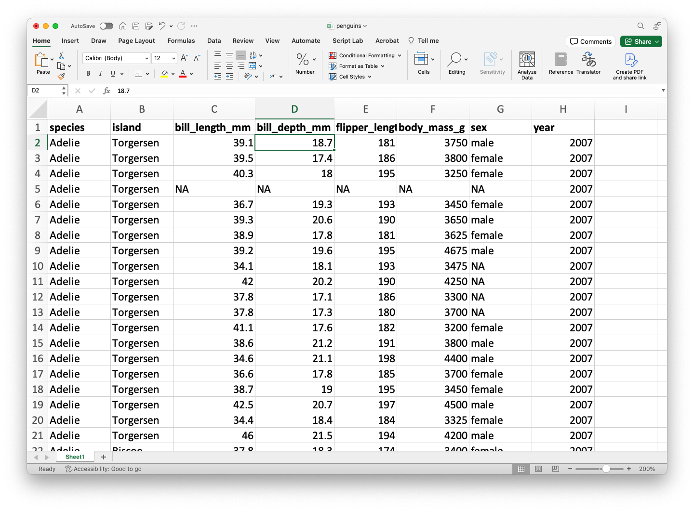
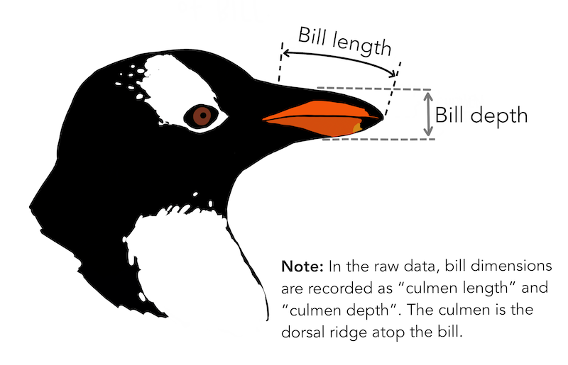
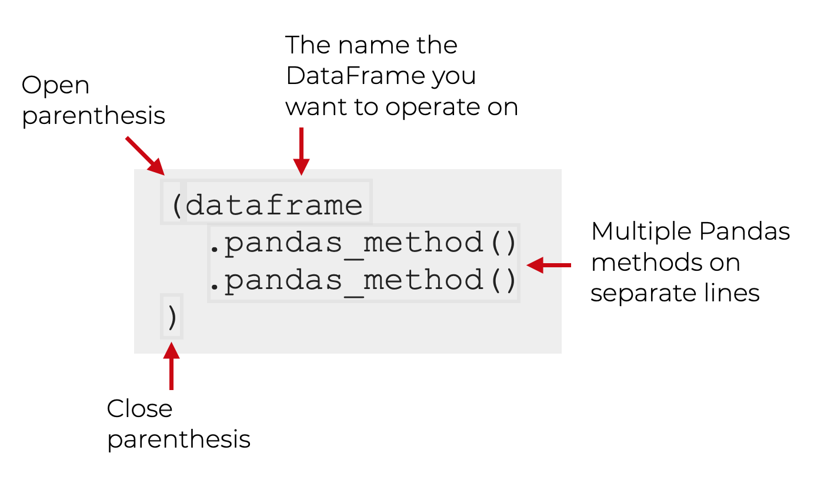
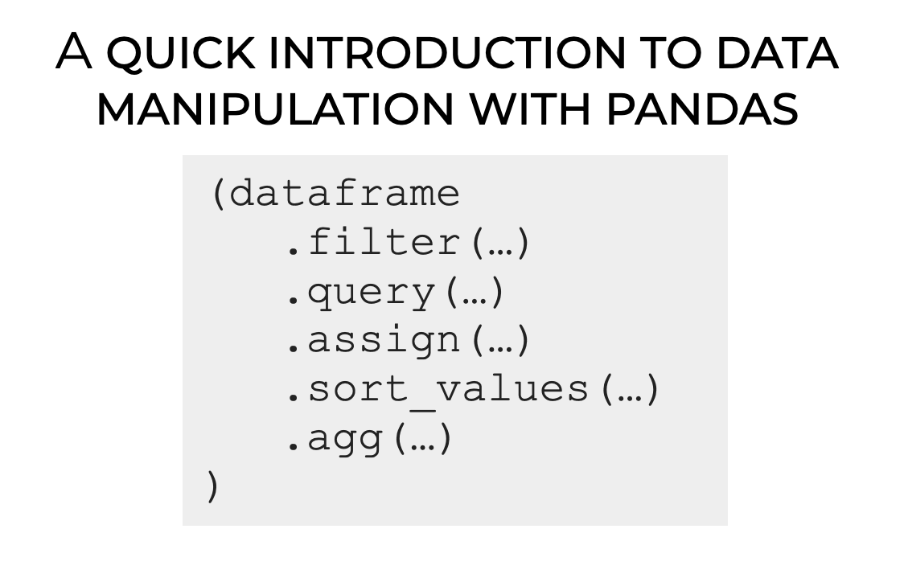
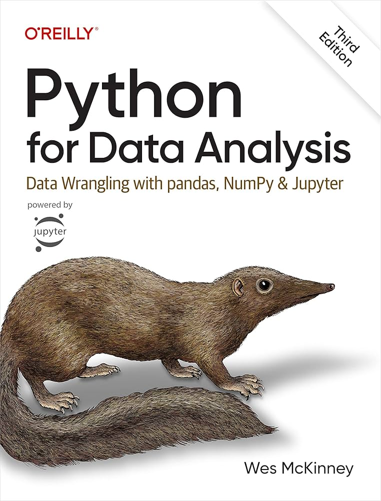
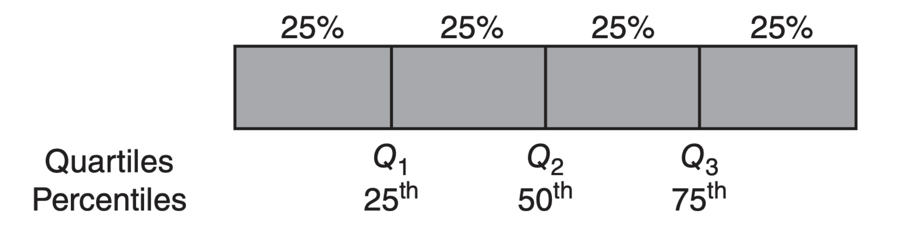
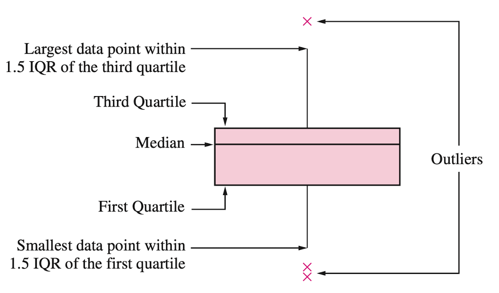

## Agenda

</br>

1. Introducción a Python
2. Lectura de Datos con Python
3. Manipulación de Datos con **pandas**
4. Visualización de Datos con **matplotlib** y **seaborn**

# Introducción a Python

## Python

</br>

::::: columnas
::: {.column width="70%"}
- Un lenguaje de programación versátil.

- ¡Es gratuito!

- Se utiliza ampliamente para la limpieza, visualización y modelado de datos.

- Se puede ampliar con paquetes (librerías) desarrollados por otros usuarios.
:::

::: {.column width="30%"}
{fig-align="center" width="324"}
:::
:::::

## Google Colab

*Plataforma gratuita de colaboración en la nube de Google para crear documentos Python.*

- Ejecuta Python y colabora en cuadernos Jupyter gratis.

- Aprovecha la potencia de las GPU gratis para acelerar tus proyectos de ciencia de datos.

- Guarda y sube fácilmente tus cuadernos a Google Drive.

{fig-align="right" width="2560"}

## Probemos un comando en Python

</br></br>

¿Qué crees que sucederá si ejecutamos este comando?

```{python}
#| echo: true
#| output: false

print("Hello world!")
```

. . .

```{python}
#| echo: false
#| output: true

print("Hello world!")
```

## Probemos con otro comando

</br></br>

¿Qué crees que sucederá si ejecutamos este comando?
```{python}
#| echo: true
#| output: false

sum([1, 5, 10])
```

. . .

```{python}
#| echo: false
#| output: true

sum([1, 5, 10])
```

## Usar Python como calculadora básica

</br></br>

```{python}
#| echo: true
#| output: true

5 + 1
```

```{python}
#| echo: true
#| output: true

10 - 3
```

```{python}
#| echo: true
#| output: true

2 * 4
```

```{python}
#| echo: true
#| output: true

9 / 3
```

## Comentarios

</br>

A veces escribimos cosas en la ventana de código que queremos que Python ignore. Estos se llaman comentarios y comienzan con `#`.

</br>

Python ignorará los comentarios y simplemente ejecutará el código.

```{python}
#| echo: true
#| output: true

# puedes poner lo que sea después de #
# por ejemplo... blah blah blah
```

::: notes
Si desea escribir un comentario que ocupe más de una línea, es una buena idea poner un \# al principio de cada línea.
:::

## Funciones en Python

</br>

Una de las mejores características de Python es la gran cantidad de comandos integrados que puedes usar. Estos se llaman *funciones*.

. . . 

Las funciones tienen dos partes básicas:

::: incremental
- La primera parte es el nombre de la función (por ejemplo, `sum`).

- La segunda parte es el valor de entrada para la función, que va dentro de los paréntesis (`sum([1, 5, 15])`).
:::

## Python es estricto

Python es muy estricto. Por ejemplo, si escribes:

```{python}
#| echo: true
sum([1, 100])
```

te dará como resultado 101.

. . . 

Pero si escribes:

```{python}
#| echo: true
#| error: true
Sum([1, 100])
```

con la “s” en mayúscula, actuará como si no tuviera ni idea de lo que estamos hablando.

::: notes
lo mismo si olvidas incluir un parentesis
:::

## Guarda tu trabajo en objetos

</br>

Prácticamente cualquier cosa, incluyendo los resultados de cualquier función de Python, se puede guardar en un *objeto*.

Esto se logra usando el operador de asignación, que puede ser el símbolo de igual (`=`).

. . . 

Puedes inventar cualquier nombre para un objeto de Python. Sin embargo, hay dos reglas básicas:

::: incremental
1. Debe ser diferente del nombre de una función en Python.

2. Debe ser lo más específico posible.

:::

## Por ejemplo

</br>

```{python}
#| echo: true

# Este código asignará el número 18
# al objeto llamado my_favorite_number

mi_numero_favorito = 18
```

Tras ejecutar este código, no ocurre nada. Pero si ejecutamos el objeto por separado, podemos ver qué contiene.

```{python}
#| echo: true

mi_numero_favorito
```

También puedes usar `print(mi_numero_favorito)`.

## Listas

Hasta ahora hemos usado objetos de Python para almacenar un solo número. Pero en estadística trabajamos con variación, que por definición requiere más de un número.

. . . 

Un objeto de Python también puede almacenar un conjunto completo de números, llamado *lista*.

Puedes pensar en una lista como un vector de números (o valores).

. . . 

El comando `[]` se puede usar para combinar varios valores individuales en una lista.

::: notes
puedes pensar que el c es por combinar
:::

## Por ejemplo

</br>

Este código crea dos vectores

```{python}
#| echo: true

mi_lista = [1, 2, 3, 4, 5]
mi_lista_2 = [10, 10, 10, 10, 10]
```

Veamos su contenido

```{python}
#| echo: true
mi_lista
```

```{python}
#| echo: true
mi_lista_2
```

## Operaciones

</br>

Podemos realizar operaciones sencillas con vectores. Por ejemplo, podemos sumar todos los elementos de una lista.

```{python}
#| echo: true

mi_lista = [1, 2, 3, 4, 5]
sum(mi_lista)
```

## Indexación

</br>

Podemos indexar una posición en el vector usando corchetes con un número como este: `[1]`.

Así, si quisiéramos imprimir el contenido de la primera posición en `my_list`, podríamos escribir:

```{python}
#| echo: true

mi_lista[1]
```

[**Una característica de Python es que el primer elemento de una lista o vector se indexa usando el número 0.**]{style="color:red;"}

```{python}
#| echo: true

mi_lista[0]
```

## Un poco más sobre objetos en Python

</br>

Puedes pensar en los objetos de Python como contenedores que almacenan valores.

Un objeto de Python puede almacenar un solo valor o un grupo de valores (como un vector).

Hasta ahora, solo hemos almacenado números en objetos de Python.

. . .

<br/>

***Los objetos de Python pueden contener tres tipos de valores: números, caracteres y booleanos.***

## Valores de los caracteres

Los caracteres se componen de texto, como palabras u oraciones. Un ejemplo de una lista con caracteres como elementos es:

. . .

```{python}
#| echo: true

muchos_saludos = ["hi", "hello", "hola", "bonjour", "ni hao", "merhaba"]
muchos_saludos
```

. . .

Es importante saber que los números también pueden tratarse como caracteres, según el contexto.

Por ejemplo, cuando el número 20 se escribe entre comillas (`"20"`), se tratará como un carácter, aunque esté entre comillas.

## Valores booleanos

</br>

Los valores booleanos son `Verdadero` o `Falso`.

Podríamos tener una pregunta como esta:

- ¿El primer elemento del vector `many_greetings` es `"hola"`?

. . .

Podemos pedirle a Python que lo averigüe y devuelva la respuesta `Verdadero` o `Falso`.

```{python}
#| echo: true

muchos_saludos[1] == "hola"
```

## Operadores lógicos

</br>

La mayoría de las preguntas que le pedimos a Python que responda con `True` o `False` involucran operadores de comparación como `>`, `<`, `>=`, `<=` y `==`.

El doble signo `==` comprueba si dos valores son iguales. Incluso existe un operador de comparación para comprobar si los valores *no* son iguales: `!=`.

Por ejemplo, `5 != 3` es una proposición `True`.

## Operadores lógicos comunes

</br>

- `>` (mayor que)

- `>=` (mayor o igual que)

- `<` (menor que)

- `<=` (menor o igual que)

- `==` (igual a)

- `!=` (distinto de)

## Pregunta

</br>

Lee este código y predice su respuesta. Luego, ejecuta el código en Google Colab y comprueba si acertaste.

```{python}
#| echo: true
#| output: false

A = 1
B = 5
comparacion = A > B
comparacion
```

## Cultura de la programación: Ensayo y error

</br>

La mejor manera de aprender a programar es experimentando y viendo qué sucede. Escribe código, ejecútalo y analiza por qué no funcionó.

Hay muchas maneras de cometer pequeños errores al programar (por ejemplo, escribir una mayúscula cuando se necesita una minúscula).

A menudo tenemos que encontrar estos errores mediante ensayo y error.

## Librerías de Python

</br>

Las librerías son las unidades fundamentales del código Python reproducible. Incluyen funciones reutilizables, documentación sobre cómo usarlas y datos de ejemplo.

En este curso, trabajaremos principalmente con las siguientes librerías:

- `pandas` para manipulación de datos
- `matplotlib` y `seaborn` para visualización de datos
- `scipy` y `statsmodels` para el análisis de datos

# Lectura de Datos con Python

## Carga de datos en Python

En este curso, asumiremos que los datos están almacenados en un archivo de Excel. Como ejemplo, utilizaremos el archivo `penguins.xlsx`.

::::: columns
::: {.column width="50%"}
{width="418"}
:::

::: {.column width="50%"}
{width="396"}
:::
:::::

::: {style="font-size: 85%;"}
::: {style="text-align: center;"}
[***El archivo debe haber sido subido previamente a Google Colab.***]{style="color:red;"}
:::
:::

## 

El conjunto de datos `penguins.xlsx` contiene información sobre pingüinos que viven en tres islas.

{fig-align="center"}

## Librería **pandas**

::::: columns
::: {.column width="30%"}
{fig-align="left"}
:::

::: {.column width="70%"}
- **pandas** es una librería de Python de código abierto para la manipulación y el análisis de datos.
- Está construida sobre **numpy** para operaciones de datos de alto rendimiento.
- Permite al usuario importar, limpiar, transformar y analizar datos de forma eficiente.
- <https://pandas.pydata.org/>
:::
:::::

## Importación de pandas

Afortunadamente, la librería **pandas** ya viene preinstalada en Google Colab.

</br>

Sin embargo, debemos indicarle a Google Colab que queremos usar **pandas** y sus funciones mediante el siguiente comando:

```{python}
#| echo: true

import pandas as pd
```

</br>

El comando `as pd` nos permite asignar un nombre corto a **pandas**. Para usar una función de **pandas**, usamos el comando `pd.function()`.

## Carga de datos con pandas

</br>

El siguiente código muestra cómo leer los datos del archivo "penguins.xlsx" en Python.

```{python}
#| echo: true

penguins_data = pd.read_excel("penguins.xlsx")
```

## La función `head()`

La función `head()` permite imprimir las primeras filas de un dataframe de pandas.

```{python}
#| echo: true

# Imprime las primeras 4 filas de los datos.
penguins_data.head(4)
```

## Tipos de datos

En Python, comprobamos el tipo de cada variable en un conjunto de datos utilizando la función `info()`.

```{python}
#| echo: true

penguins_data.info()
```

## Formatos generales de Python

</br></br>

- Formato `float64` para variables numéricas con decimales.

- Formato `int64` para variables numéricas con enteros.

- Formato `object` para variables generales con caracteres.

## Definir variables categóricas

Técnicamente, la variable `sex` en `penguins_data` es [**categórica**]{style="color:pink;"}. Para indicárselo explícitamente a Python, usamos el siguiente código.

```{python}
#| echo: true

penguins_data['sex'] = pd.Categorical(penguins_data['sex'])
```

Al definir la variable `sex` como categórica, podemos utilizar una visualización eficaz para estos datos.

Hacemos lo mismo con las demás variables categóricas: `species` e `isisland`.

```{python}
#| echo: true

penguins_data['species'] = pd.Categorical(penguins_data['species'])
penguins_data['island'] = pd.Categorical(penguins_data['island'])
```

## 

</br>

Vamos a comprobar de nuevo el tipo de variables.

```{python}
#| echo: true

penguins_data.info()
```


# Manipulación de Datos con **pandas**

## Encadenamiento de operaciones

Una de las técnicas más importantes de **pandas** es el encadenamiento ([**chaining**]{style="color:brown;"}), que permite una manipulación de datos más limpia y legible.

La estructura general del encadenamiento es la siguiente:

{fig-align="center"}

## Métodos clave de pandas

**pandas** proporciona métodos o funciones para resolver tareas comunes de manipulación de datos:

::: incremental
- `.filter()` selecciona columnas o filas específicas.

- `.query()` filtra observaciones según ciertas condiciones.

- `.assign()` agrega nuevas variables que son funciones de variables existentes.

- `.sort_values()` cambia el orden de las filas.

- `.agg()` reduce varios valores a un único resumen numérico.
:::

## 

{fig-align="center"}

Para practicar, utilizaremos el conjunto de datos `penguins_data`.

## Seleccionar columnas con `.filter()`

Seleccione las columnas `species`, `body_mass_g` y `sex`.

```{python}
#| eval: true
#| echo: true

(penguins_data
  .filter(["species", "body_mass_g", "sex"], axis = 1)
).head()
```

## 

</br>

El argumento `axis` le indica a `.filter()` si debe seleccionar filas (`0`) o columnas (`1`) del dataframe.

```{python}
#| output: false
#| echo: true

(penguins_data
  .filter(["species", "body_mass_g", "sex"], axis = 1)
).head()
```

</br>

> El comando `.head()` nos permite imprimir las primeras seis filas del nuevo dataframe. **Debemos eliminarlo** para obtener el dataframe completo.

## 

</br>

También podemos usar `.filter()` para seleccionar filas. Para ello, establecemos `axis = 1`. Podemos seleccionar filas específicas, como la 0 y la 10.

```{python}
#| output: true
#| echo: true

(penguins_data
  .filter([0, 10], axis = 0)
)
```

## 

O bien, podemos seleccionar un conjunto de filas usando la función `range()`. Por ejemplo, seleccionemos las primeras 5 filas.

```{python}
#| output: true
#| echo: true

(penguins_data
  .filter(range(5), axis = 0)
)
```

## Filtrado de filas con `.query()`

</br>

Una forma alternativa de seleccionar filas es mediante `.query()`. A diferencia de `.filter()`, `.query()` nos permite filtrar los datos utilizando sentencias o consultas que involucran las variables.

</br>

Por ejemplo, filtremos los datos de la especie "Gentoo".

```{python}
#| output: false
#| echo: true

(penguins_data
  .query("species == 'Gentoo'")
)
```

## 

</br>

```{python}
#| output: true
#| echo: true

(penguins_data
  .query("species == 'Gentoo'")
).head()
```

## 

También podemos filtrar los datos para obtener pingüinos con una masa corporal superior a 5000g.

```{python}
#| eval: true
#| echo: true

(penguins_data
  .query("body_mass_g > 5000")
).head()
```

## 

Incluso podemos **combinar** `.filter()` y `.query()`. Por ejemplo, seleccionemos las columnas `species`, `body_mass_g` y `sex`, y luego filtremos los datos para la especie "Gentoo".

```{python}
#| eval: true
#| echo: true

(penguins_data
  .filter(["species", "body_mass_g", "sex"], axis = 1)
  .query("species == 'Gentoo'")
).head(4)
```

## Crear nuevas columnas con `.assign()`

Con `.assign()`, podemos crear nuevas columnas (variables) que son funciones de las existentes. Esta función utiliza una palabra clave especial de Python llamada `lambda`. Técnicamente, esta palabra clave define una función *anónima*.

Por ejemplo, creamos una nueva variable `LDRatio` que es igual a la relación entre `bill_length_mm` y `bill_depth_mm`.

```{python}
#| output: false
#| echo: true

(penguins_data
  .assign(LDRatio = lambda df: df["bill_length_mm"] / df["bill_depth_mm"])
)
```

## 

</br>

En este código, el `df` después de `lambda` indica que el dataframe (`penguins_data`) se denominará `df` dentro de la función. Los dos puntos `:` marcan el inicio de la función.

```{python}
#| output: false
#| echo: true

(penguins_data
  .assign(LDRatio = lambda df: df["bill_length_mm"] / df["bill_depth_mm"])
)
```

El código agrega la nueva variable al final del dataframe resultante.

## 

Podemos ver la nueva variable usando `.filter()`.

```{python}
#| output: true
#| echo: true

(penguins_data
  .assign(LDRatio = lambda df: df["bill_length_mm"] / df["bill_depth_mm"])
  .filter(["bill_length_mm", "bill_depth_mm", "LDRatio"], axis = 1)
).head()
```

## Ordenación con `.sort_values()`

Podemos ordenar los datos según una columna como `bill_length_mm`.

```{python}
#| eval: true
#| echo: true

(penguins_data
  .sort_values("bill_length_mm")
).head(4)
```

## 

Para ordenar en orden descendente, utilice `ascending=False` dentro de `sort_values()`.

```{python}
#| eval: true
#| echo: true

(penguins_data
  .sort_values("bill_length_mm", ascending=False)
).head()
```

## Resumen con `.agg()`

Podemos calcular resúmenes estadísticos de `body_mass_g`.

```{python}
#| eval: true
#| echo: true

(penguins_data
  .filter(["body_mass_g"], axis = 1)
  .agg(["mean", "var", "std"])
)
```

> Por defecto, `agg()` ignora los valores faltantes.


## 

</br>

Podemos calcular resúmenes estadísticos de varias columnas al mismo tiempo.

```{python}
#| eval: true
#| echo: true

(penguins_data
  .filter(["bill_length_mm", "bill_depth_mm", "body_mass_g"], axis = 1)
  .agg(["mean", "var", "std"])
)
```


## Guarda los resultados en un objeto

Tras realizar operaciones con nuestros datos, podemos guardar el resultado como un nuevo objeto.

```{python}
#| eval: true
#| echo: true

summary_penguins_data = (penguins_data
  .filter(["bill_length_mm", "bill_depth_mm", "body_mass_g"], axis = 1)
  .agg(["mean", "var", "std"])
)

summary_penguins_data
```

## Más sobre pandas

{fig-align="center"}

::: {style="font-size: 50%;"}
<https://wesmckinney.com/book/>
:::

# Visualización de Datos con **matplotlib** y **seaborn**

## Ejemplo

</br>

Un criminólogo está desarrollando un sistema basado en reglas para clasificar los tipos de vidrio encontrados en investigaciones criminales.

Los datos consisten en 214 muestras de vidrio etiquetadas en una de siete categorías.

Hay nueve predictores, incluyendo el índice de refracción y los porcentajes de ocho elementos: Na, Mg, Al, Is, K, Ca, Ba y Fe. La respuesta es el tipo de vidrio.

## 

</br>

El conjunto de datos se encuentra en el archivo "glass.xlsx". Vamos a cargarlo usando **pandas**.

```{python}
#| echo: true
#| output: true

# Cargar el archivo de Excel en un DataFrame de pandas.
glass_data = pd.read_excel("glass.xlsx")
```

</br>

La variable `Type` es categórica. Por lo tanto, asegurémonos de que Python lo sepa usando el siguiente código.

```{python}
#| echo: true
#| output: true

glass_data['Type'] = pd.Categorical(glass_data['Type'])
```

## Librería **matplotlib**

- **matplotlib** es una librería completa para crear visualizaciones estáticas, animadas e interactivas.

- Es ampliamente utilizada en la comunidad de ciencia de datos para graficar datos en diversos formatos.

- Ideal para crear visualizaciones sencillas como gráficos de líneas, gráficos de barras, diagramas de dispersión y más.

- <https://matplotlib.org/>

{fig-align="center"}

## Librería **seaborn**

- **seaborn** es una librería de Python basada en Matplotlib.
- Diseñada para facilitar y embellecer la visualización de datos estadísticos.
- Ideal para crear visualizaciones informativas y atractivas con un mínimo de código.
- <https://seaborn.pydata.org/index.html>

{fig-align="center"}

## Importación de las librerías

</br>

Las librerías **matplotlib** y **seaborn** vienen preinstaladas en Google Colab. Sin embargo, debemos indicarle a Google Colab que queremos usarlas, junto con sus funciones, mediante el siguiente comando:

```{python}
#| echo: true

import matplotlib.pyplot as plt
import seaborn as sns
```

Al igual que con **pandas**, el comando `as sns` nos permite usar un nombre corto para **seaborn**. De forma similar, renombramos **matplotlib** como **plt**.

## Histograma

</br></br>

Representación gráfica que muestra la distribución de la muestra, indicando las regiones donde se concentran los puntos y las regiones donde son menos numerosos.

</br>

Las barras del histograma se tocan. Un espacio indica que no hay observaciones en ese intervalo.

## Histograma de Na

Para crear un histograma, utilizamos la función `histplot()` de **seabron**.

```{python}
#| echo: true
#| output: true
#| fig-align: center
#| code-fold: true

plt.figure(figsize=(7,4)) # Crea espacio para la figura.
sns.histplot(data = glass_data, x = 'Na') # Crea el histograma.
plt.title("Histogram of Na") # Título de la gráfica.
plt.xlabel("Na") # Etiqueta del eje X
plt.show() # Muestra la Gráfica
```


## Gráfica de caja

Muestra la mediana, el primer y tercer cuartil, y cualquier valor "atípico" presente en la muestra.

. . . 

La [**mediana muestral**]{style="color:darkgreen;"} es el valor central de los datos ordenados.

. . . 

Los [**cuartiles de muestra**]{style="color:darkgreen;"} dividen los datos en cuartiles lo más aproximado posible:

::: {style="font-size: 85%;"}
::: incremental
- El primer cuartil ($Q_1$) es la mediana de la mitad inferior de los datos.

- El segundo cuartil ($Q_2$) es la mediana o valor central de los datos.

- El tercer cuartil ($Q_3$) es la mediana de la mitad superior de los datos.
:::
:::

## 

</br></br>



## 

</br>

En Python, los cuartiles se calculan utilizando la función `quantile()`.

```{python}
#| echo: true
#| output: true

# Fijar cuantiles.
set_quantiles = [0.25, 0.5, 0.75]
# Calcular cuantiles.
(penguins_data
 .filter(['bill_length_mm'], axis = 1)
 .agg("quantile", q = set_quantiles)
)
```

## Anatomía de una gráfica de cajas

::::: columns
::: {.column width="40%"}
El rango intercuartil (RIC) es la diferencia entre el tercer cuartil y el primer cuartil ($Q_3 - Q_1$). Esta es la distancia necesaria para abarcar la mitad central de los datos.
:::
::: {.column width="60%"}
{fig-align="center"}
:::
:::

::: {style="font-size: 85%;"}
Ver [**https://towardsdatascience.com/why-1-5-in-iqr-method-of-outlier-detection-5d07fdc82097**](#0){.uri}
:::

## Gráfica de caja de Na

Para crear una gráfica de caja, utilizamos la función `boxplot()` de **seabron**.

```{python}
#| echo: true
#| output: true
#| fig-align: center
#| code-fold: true

plt.figure(figsize=(7,4)) # Create space for the figure.
sns.boxplot(data = glass_data, y = 'Na') # Create boxplot.
plt.title("Box plot of Na") # Add title.
plt.show() # Show the plot.
```

## Valores atípicos

</br>

Los valores atípicos son puntos que son mucho mayores o menores que el resto de los puntos de la muestra.

Pueden deberse a errores de introducción de datos o a que realmente son diferentes del resto.

No se deben eliminar los valores atípicos sin una cuidadosa consideración; a veces, los cálculos y análisis se realizan con y sin valores atípicos, y luego se comparan.


## Gráfica de barras

Describe datos [**categóricos**]{style="color:pink;"} clasificados en diversas categorías según el sector, la región, diferentes periodos de tiempo u otros factores similares.

Los diferentes sectores, regiones o periodos de tiempo se etiquetan como categorías específicas.

Un gráfico de barras se construye creando categorías que se representan mediante etiquetas y que se representan mediante intervalos de igual longitud en un eje horizontal.

La frecuencia o el recuento dentro de la categoría correspondiente se representa mediante una barra cuya altura es proporcional a la frecuencia.

## 

Creamos el gráfico de barras utilizando la función `countplot()` de **seaborn**.

```{python}
#| echo: true
#| output: true
#| fig-align: center
#| code-fold: true

# Create plot.
plt.figure(figsize=(7,4)) # Create space for the plot.
sns.countplot(data = glass_data, x = 'Type') # Show the plot.
plt.title("Bar chart of Type of Glasses") # Set plot title.
plt.ylabel("Frequency") # Set label for Y axis.
plt.show() # Show plot.
```

## Guardar gráficos

</br>

Guardamos una figura usando la función `.save.fig()` de **matplotlib**. El argumento `dpi` de esta función establece la resolución de la imagen. Cuanto mayor sea el valor de `dpi`, mejor será la resolución.

```{python}
#| echo: true
#| output: false

plt.figure(figsize=(5, 7))
sns.countplot(data = glass_data, x = 'Type')
plt.title('Frequency of Each Category')
plt.ylabel('Frequency')
plt.xlabel('Category')
plt.savefig('bar_chart.png',dpi=300)
```

## Mejorando la figura

También podemos usar otras funciones para mejorar el aspecto de la figura:

::: {style="font-size: 96%;"}
- `plt.title(fontsize)`: Tamaño de fuente del título.

- `plt.ylabel(fontsize)`: Tamaño de fuente del título del eje Y.

- `plt.xlabel(fontsize)`: Tamaño de fuente del título del eje X.

- `plt.yticks(fontsize)`: Tamaño de fuente de las etiquetas del eje Y.

- `plt.xticks(fontsize)`: Tamaño de fuente de las etiquetas del eje X.
:::

## 

```{python}
#| echo: true
#| output: true
#| fig-align: center

plt.figure(figsize=(5, 5))
sns.countplot(data = glass_data, x = 'Type')
plt.title('Relative Frequency of Each Category', fontsize = 12)
plt.ylabel('Relative Frequency', fontsize = 12)
plt.xlabel('Category', fontsize = 15)
plt.xticks(fontsize = 12)
plt.yticks(fontsize = 12)
plt.savefig('bar_chart.png',dpi=300)
```


# [Return to main page](https://alanrvazquez.github.io/TEC-IN2032/)
