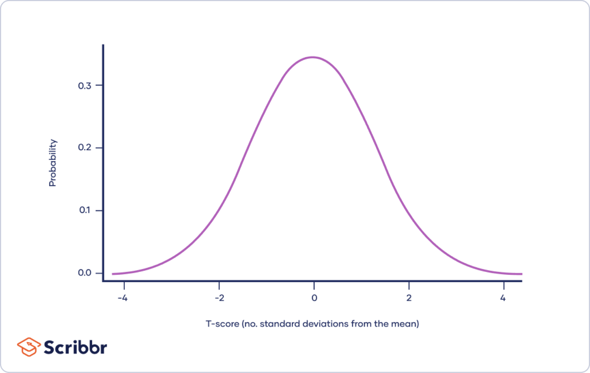
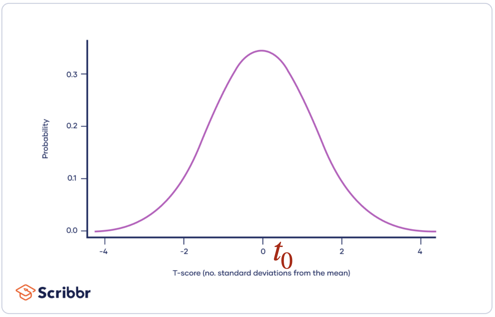
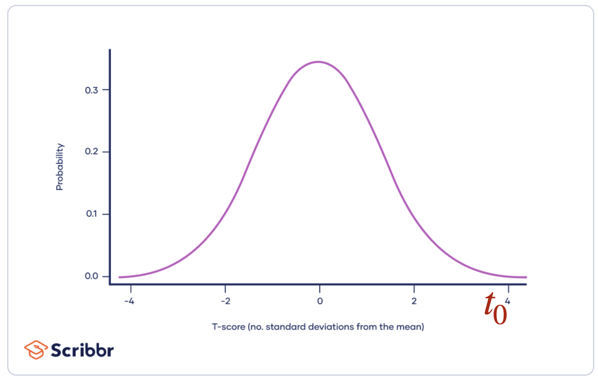
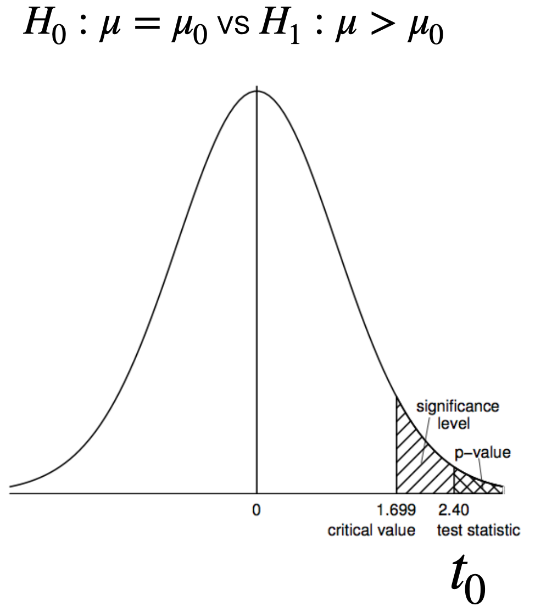
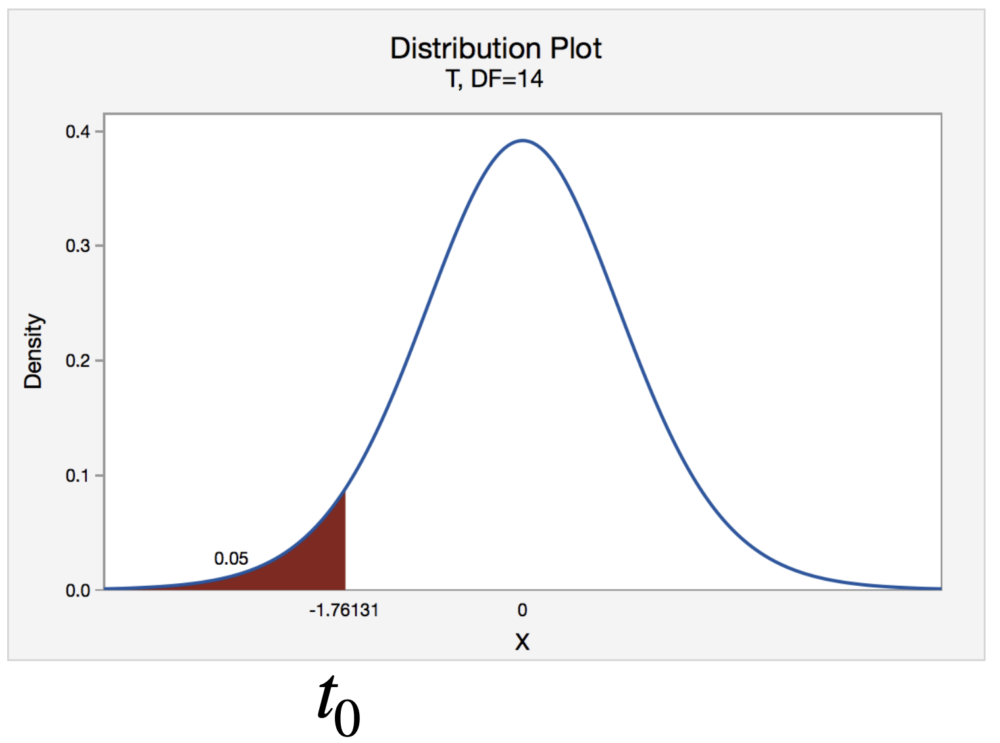
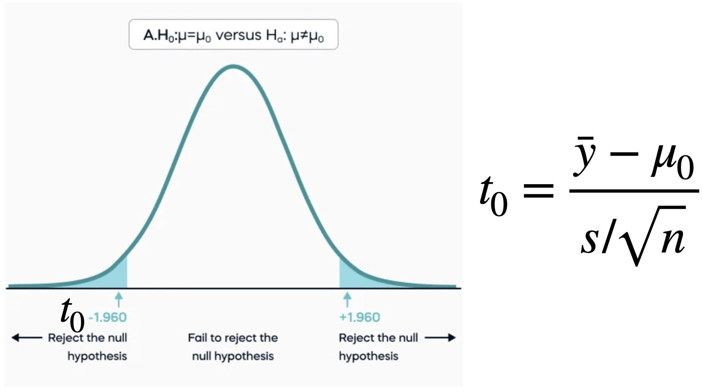
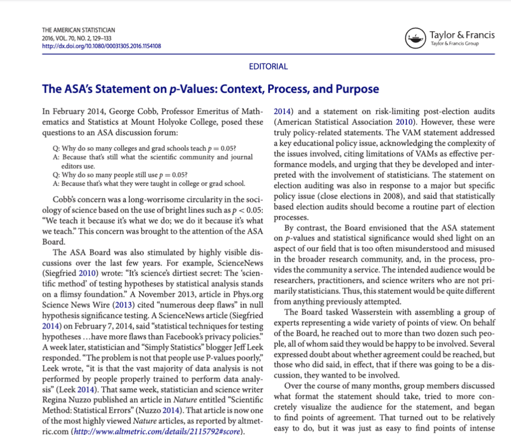
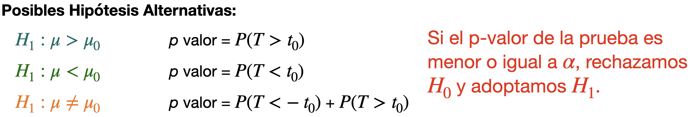
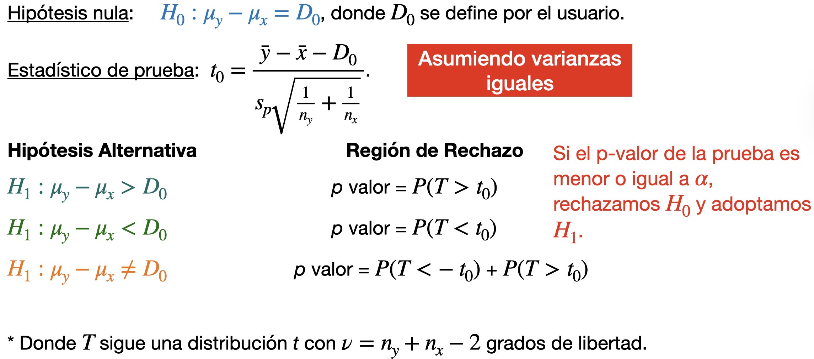
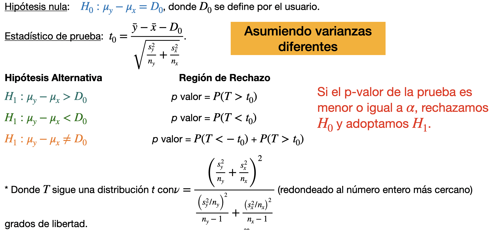

## Agenda

</br>

- Conceptos Básicos

- Pruebas de Muestras Pequeñas

- Comentarios Finales

## Carguemos las librerías

</br></br></br>

Antes de empezar, carguemos las librerías que usaremos hoy.

```{python}
#| echo: true
#| output: true

import pandas as pd
import matplotlib.pyplot as plt
import seaborn as sns
from scipy.stats import sem, t, ttest_ind, ttest_1samp
```

En el cógido de arriba, indicamos que utilizaremos la función `sem()` de la librería **scipy.stats**.

# Conceptos Básicos

## Introducción

</br></br>

Recuerda que el objetivo de la estadística es hacer inferencias sobre parámetros poblacionales desconocidos basándose en la información contenida en los datos de la muestra.

</br>

Estas inferencias se expresan de dos maneras:

::: incremental
- [**Intervalos de confianza**]{style="color: #5E7D6A"} de un parámetro.
- [**Prueba de hipótesis**]{style="color: #4682B4"} sobre su valor.
:::

## Idea general

Consideremos una población (distribución) en estudio con un parámetro objetivo. Una prueba de hipótesis sigue los pasos generales siguientes.

::: incremental
1.  [**Plantear una hipótesis**]{style="color: #4682B4"} sobre el parámetro. Por ejemplo, equivale a un valor especificado por el usuario.

2.  [**Recolectar una muestra**]{style="color: #4682B4"} de la población y comparar los valores observados con la hipótesis.

3.  Si las observaciones no están de acuerdo con la hipótesis, [**la rechazamos. De lo contrario, concluimos que la hipótesis es verdadera**]{style="color: #4682B4"} o que la muestra [**no proporcionó suficiente información**]{style="color: #4682B4"} para la prueba.
:::

## Paso 1. Hipótesis

</br></br>

Una **hipótesis** es una afirmación sobre un parámetro de población.

</br>

. . .

Hay dos tipos de hipótesis:

La [**hipótesis nula**]{style="color: darkblue"} se denota con $H_0$.

La [**hipótesis alternativa**]{style="color: darkgreen"} se denota con $H_1$.

## 

</br>

Para un parámetro objetivo $\mu$ y un *valor hipotético* (especificado por el usuario) $\mu_0$, nos concentraremos en hipótesis del siguiente tipo:

</br>

::: {style="text-align: center;"}
$H_0: \mu = \mu_0$ contra $H_1: \mu \neq \mu_0$

$H_0: \mu \leq \mu_0$ contra $H_1: \mu > \mu_0$

$H_0: \mu \geq \mu_0$ contra $H_1: \mu < \mu_0$
:::

</br>

[La **hipótesis alternativa** suele ser la hipótesis que buscamos sustentar con base en la información contenida en la muestra.]{style="color:#4a6c40"}

## 

A veces, también escribimos la hipótesis nula de esta manera:

</br>

::: {style="text-align: center;"}
$H_0: \mu = \mu_0$ contra $H_1: \mu \neq \mu_0$

$H_0: \mu = \mu_0$ contra $H_1: \mu > \mu_0$

$H_0: \mu = \mu_0$ contra $H_1: \mu < \mu_0$
:::

</br>

Esto es como asumir el valor más extremo posible de $\mu$ bajo $H_0$.

> Es decir, el valor mínimo (o máximo) para que $H_0$ sea verdadera.

## Ejemplo 1

</br>

::: incremental
- **Pregunta de investigación 1**: ¿El alquiler mensual promedio de un apartamento de un dormitorio en la zona Tec es mayor a 15,000 pesos? $H_0: \mu \leq 15,000$ contra $H_1: \mu > 15,000$, donde $\mu$ es el alquiler mensual promedio de *todos* los apartamentos de un dormitorio en la zona Tec.

- **Pregunta de investigación 2**: ¿La mayoría de los estudiantes del campus del Tec tienen un perro? $H_0: p = 0.5$ contra $H_1: p > 0.5$, donde $p$ es la proporción de *todos* de estudiantes que poseen un perro.
:::

## Paso 2. Muestra y Estadístico de Prueba

</br>

Normalmente, una prueba de hipótesis se especifica en términos de [**estadístico de prueba**]{style="color: darkgreen"} $T$.

Un estadístico de prueba es una función de la muestra $Y_1, \ldots, Y_n$, en la que se basará la decisión estadística. Por tanto, también es una variable aleatoria.

Una estadístico de prueba tiene [una distribución de probabilidad asociada, que depende de la hipótesis asumida]{style="color: darkgreen"} ($H_0$ o $H_1$).

## Ejemplo: Prueba de hipótesis sobre la media

:::::: {style="font-size: 90%;"}
Considera una muestra pequeña $y_1, \ldots, y_n$ [que se distribuye]{.underline} como [$N(\mu, \sigma^2)$]{style="color: darkred"}.

[Hipótesis nula]{.underline}: [$H_0: \mu = \mu_0$ donde $\mu$ es un valor (constante) elegido por el usuario.]{style="color: #4682B4"}

::::: columns
::: {.column width="50%"}
**Posibles Hipótesis Alternativas**:

- [$H_1: \mu > \mu_0$]{style="color: #40E0D0"}\
- [$H_1: \mu < \mu_0$]{style="color: green"}\
- [$H_1: \mu \neq \mu_0$]{style="color: orange"}
:::

::: {.column width="50%"}
[Estadístico de Prueba]{.underline}:

$t_0 = \frac{\bar{y} - \mu_0}{s/\sqrt{n}}$ donde $\bar{y}$ y $s$ son el promedio y desviación estándar de la muestra observada.
:::
:::::
::::::

## Distribución del estadístico de prueba

</br></br>

::::: columns
::: {.column width="50%"}
Si $H_0: \mu = \mu_0$ es [**verdadera**]{style="color:#4682B4"}, $t_0 = \frac{\bar{y} - \mu_0}{s/\sqrt{n}}$ sigue una [distribución $t$]{style="color:#4682B4"} con $n-1$ grados de libertad.
:::

::: {.column width="50%"}
{fig-align="center"}
:::
:::::

## Paso 3. Rechazar o no rechazar $H_0$

</br></br></br>

Al realizar una prueba de hipótesis, existen dos decisiones posibles: [**rechazar**]{style="color:#4a6c40"} [o]{.underline} [**no rechazar**]{style="color:#4a6c40"} $H_0$.

</br>

Para ello, comprobamos si el valor observado del estadístico de prueba es poco o muy probable asumiendo que $H_0$ es verdadera.

## 

</br>

Si $H_0: \mu = \mu_0$ es [**verdadera**]{style="color:#4682B4"}, $t_0 = \frac{\bar{y} - \mu_0}{s/\sqrt{n}}$ sigue una [distribución $t$]{style="color:#4682B4"} con $n-1$ grados de libertad.

</br>

::::: columns
::: {.column width="50%"}
Si $H_0$ es [**verdad**]{style="color:#4682B4"}, $t_0$ debería de estar [**cerca de 0**]{style="color:#4682B4"}, el valor con más densidad de la distribución $t$.
:::

::: {.column width="50%"}
{fig-align="center"}
:::
:::::

## 

</br>

Si $H_0: \mu = \mu_0$ [**no es verdadera**]{.underline}, entonces $t_0 = \frac{\bar{y} - \mu_0}{s/\sqrt{n}}$ deberá estar lejos de 0, el valor con más densidad de la distribución $t$.

</br>

::::: columns
::: {.column width="50%"}
Por ejemplo, si $H_1: \mu > \mu_0$ es [**verdad**]{style="color:#E85C78 "}, entonces $t_0$ debería de [**estar lejos de 0**]{style="color:#E85C78 "} hacia la derecha. En otras palabras, $t_0$ es poco probable asumiendo que $H_0$ es verdadera.
:::

::: {.column width="50%"}
{fig-align="center"}
:::
:::::

## Valor *p*

[**Definición**]{.underline}: El [**valor *p***]{style="color: darkgreen"} es la probabilidad de observar un valor [*al menos tan extremo*]{style="color: purple"} *como el valor observado de un estadístico* $T,$ cuando [$H_0$ es verdadera]{style="color: purple"}.

. . .

::::: columns
::: {.column width="50%"}
</br>

Un p-valor pequeño es equivalente a decir que $t_0 = \frac{\bar{y} - \mu_0}{s/\sqrt{n}}$ esta “lejos” de 0.

Sugiriendo que la hipótesis nula $H_0$ no es verdadera.
:::

::: {.column width="50%"}
{fig-align="center" width="388"}
:::
:::::

## 

</br>

Para [$H_0: \mu = \mu_0$ vs $H_1: \mu < \mu_0$]{style="color: purple"}, el p-valor se calcula usando la cola izquierda de la distribución $t$.

</br>

::::: columns
::: {.column width="50%"}
De la misma manera, un p-valor pequeño es equivalente a decir que $t_0 = \frac{\bar{y} - \mu_0}{s/\sqrt{n}}$ esta “lejos” de 0.

Sugiriendo que la hipótesis nula $H_0$ no es verdadera.
:::

::: {.column width="50%"}
{fig-align="center"}
:::
:::::

## 

Para [$H_0: \mu = \mu_0$ vs $H_1: \mu \neq \mu_0$]{style="color: purple"}, el p-valor se calcula usando las dos colas de la distribución $t$.

{fig-align="center" width="509"}

Usamos las dos colas porque la hipótesis alternativa se enfoca en una diferencia entre el valor real $\mu$ y el asumido $\mu_0$ si importar si esta diferencia es positiva o negativa.

## El valor *p* no es la probabilidad de que $H_0$ sea cierta

Dado que el valor p es una probabilidad, y dado que los valores p pequeños indican que es poco probable que $H_0$ sea cierta, es tentador pensar que el valor p representa la probabilidad de que $H_0$sea cierta.

</br>

::: {style="text-align: center;"}
[¡Este no es el caso!]{style="color: darkred"}
:::

El concepto de probabilidad que se analiza aquí sólo es útil cuando se aplica a resultados que pueden producirse de diferentes maneras cuando se repiten los experimentos.

## ¿Qué tan pequeño debe de ser el p valor para rechazar $H_0$?

:::::: columns
:::: {.column width="50%"}
::: incremental
- **Respuesta**: ¡Muy pequeño!

- Pero, [*¿qué tan pequeño?*]{style="color: #E85C78"}

- **Respuesta**: ¡Muy pequeño!

- Pero, dime [*¿qué tan pequeño?*]{style="color: #E85C78"}

- **Respuesta**: Esta bien! Debe de ser menor que un valor llamado $\alpha$ el cual suele ser 0.1, 0.05, o 0.01.

- ¡Gracias!
:::
::::

::: {.column width="50%"}
{fig-align="center" width="318"}

::: {style="text-align: center;"}
[Sir. Ronald Fisher](https://simple.wikipedia.org/wiki/Ronald_Fisher)
:::

:::
::::::

## Significancia estadística

</br>

Siempre que el valor *p* es inferior al valor fijado de $\alpha$, se dice que el resultado es "estadísticamente significativo" en ese nivel.

</br>

Es decir, si $\alpha = 0.05$ y el p valor es menor que $\alpha$, el resultado es estadísticamente significativo en el nivel 5%.

</br>

Y si $\alpha = 0.01$ y el p valor es menor que $\alpha$, el resultado es estadísticamente significativo al nivel 1%.

## 

{fig-align="center"}

## Resumen

</br></br>

Los elementos de una prueba estadística son:

1.  Hipótesis nula, $H_0$.

2.  Hipótesis alternativa, $H_1$.

3.  Estadístico de prueba.

4.  Región de rechazo.

# Pruebas de Muestras Pequeñas

## Prueba de hipótesis sobre la media

::: {style="font-size: 80%;"}
Considera una muestra pequeña $y_1, \ldots, y_n$ [que se distribuye]{.underline} como [$N(\mu, \sigma^2)$]{style="color: darkred"}.

[Hipótesis nula]{.underline}: [$H_0: \mu = \mu_0$ donde $\mu$ es un valor (constante) elegido por el usuario.]{style="color: #4682B4"}

[Estadístico de Prueba]{.underline}: $t_0 = \frac{\bar{y} - \mu_0}{s/\sqrt{n}}$ donde $\bar{y}$ y $s$ son el promedio y desviación estándar de la muestra observada.

</br>
Sea $T$ una variable aleatoria que sigue una distribución $t$ con $n-1$ grados de libertad.
:::

{fig-align="center"}

## Ejemplo 3

Una bióloga estudia el peso corporal (en gramos) de cobayas al nacer. Ella recolectó una muestra de pesos de 27 cobayas recien nacidas. Los datos están en el archivo “Guinea_Pigs.xlsx” en CANVAS.

La bióloga quiere probar la hipótesis de que el peso corporal medio es menor a 300 gramos. Técnicamente, quiere probar la hipótesis:

::: {style="text-align: center;"}
$H_0: \mu = 300$ contra $H_1: \mu < 300$
:::

Donde $\mu$ es la media o promedio teórico de los pesos de todas las cobayas recien nacidas. Utiliza $\alpha = 0.05$.

## En Python

Primero, leamos los datos en el archivo "Guinea_Pigs.xlsx".

```{python}
#| echo: true

guinea_data = pd.read_excel("Guinea_Pigs.xlsx")
guinea_data.head()
```

## Visualización simple a través de un histograma

```{python}
#| echo: true
#| output: true
#| fig-align: center
#| code-fold: true

plt.figure(figsize=(7,4)) 
sns.histplot(data = guinea_data, x = 'Weight') 
plt.title("Histograma de Peso") 
plt.xlabel("Peso (en gramos)") 
plt.show() 
```

## 

</br>

Para llevar a cabo una prueba de hipótesis de una muestra, usamos la función `ttest_1samp` de **scipy.stats**. En la función, el parámetro `popmean` especifica e valor asumido $\mu_0$ en $H_0$. Además, el parámetro `alternative` indica el tipo de $H_1$.

```{python}
#| echo: true

hip_test = ttest_1samp(guinea_data, popmean = 300, 
                       alternative = 'less')
```

</br>

En este caso, $H_0: \mu = 300$ contra $H_1: \mu < 300$. Entonces `popmean = 300` y `alternative = 'less'`.

##

</br></br>

Usando `hip_test`, podemos preguntar sobre el p-valor de la prueba de hipótesis como sigue.

```{python}
#| echo: true

hip_test.pvalue
```

</br>

Como el p-valor es mayor que $\alpha=0.05$, [**no rechazamos**]{style="color: red"} $H_0$. En otras palabras, concluimos que la muestra no nos da información suficiente para decir que el promedio teórico de las cobayas recién nacidas es menor a 300.

## Intervalo de confianza 

</br>

Usando el mismo objeto `hip_test`, también podemos obtener un intervalo de confianza usando la función `.confidence_interval()`.

```{python}
#| echo: true

ci = hip_test.confidence_interval(confidence_level=0.95)
ci
```

</br>

En este caso, el intervalo de confianza es de un solo lado ya que usamos $H_1: \mu < 300$. En este caso, el intervalo de confianza del 95% es $[-\infty, 390.74]$ o $\mu \leq 390.74$.

## Pruebas para la diferencia de dos medias

</br></br>

Recuerda que si la muestra aleatoria $Y_1, \ldots, Y_{n_y}$ sigue una distribución $N(\mu_y, \sigma_{y}^2)$, entonces $\bar{Y} \sim N\left(\mu_y, \frac{\sigma_{y}^2}{n_y}\right)$.

Además, si la muestra aleatoria $X_1, \ldots, X_{n_x}$ sigue una distribución $N(\mu_x, \sigma_{x}^2)$, entonces $\bar{X} \sim N\left(\mu_x, \frac{\sigma_{x}^2}{n_x}\right)$.

## El esquema

</br>

Para definir los intervalos de confianza, necesitamos definir lo siguiente:

Para la primera muestra de observaciones $y_1, y_2, \ldots, y_{n_y}$:

- $n_y$ es el número de observaciones.
- $\bar{y} = \frac{1}{n_y}\sum_{i=1}^{n_y} y_i$ es la media muestral.
- $s^2_y =\frac{1}{n_y-1} \sum_{i=1}^{n_y} (y_i - \bar{y})^2$ es la varianza muestral.

## 

</br></br>

Para la segunda muestra de observaciones $x_1, x_2, \ldots, x_{n_x}$:

- $n_x$ es el número de observaciones.
- $\bar{x} = \frac{1}{n_x}\sum_{i=1}^{n_x} x_i$ es la media muestral.
- $s^2_{x} =\frac{1}{n_x -1} \sum_{i=1}^{n_x} (x_i - \bar{x})^2$ es la varianza muestral.

## 

Si las dos muestras son independientes, entonces un [**estadístico de prueba** para la hipótesis sobre $\mu_y - \mu_x$]{style="color: green"} es

$$T = \frac{ (\bar{y} - \bar{x}) - (\mu_{y0} - \mu_{x0})}{\text{ME}}$$

donde $\mu_{y0} - \mu_{x0}$ es la diferencia asumida en la hipótesis nula ($H_0$), y ME es el *margen de error*.

Existen dos valores posibles para ME según los casos:

::: {style="font-size: 90%;"}
- Las varianzas téoricas de las distribuciones son iguales ($\sigma_y^{2} = \sigma_x^{2}$).
- Las varianzas téoricas de las distribuciones **no** son iguales ($\sigma_y^{2} \neq \sigma_x^{2}$).
:::

## Cuando las distribuciones tienen la **misma varianza**

</br>

Si las distribuciones tienen la misma varianza teórica, entonces

$$\text{ME} = s_p = \sqrt{ \frac{ (n_y - 1)s^2_{x} + (n_x - 1)s^2_{y} }{n_y + n_x - 2} },$$

donde $s_p$ es la [*desviación estándar agrupada*]{style="color: purple"}.

## Pruebas sobre la diferencia de dos medias

{fig-align="center"}

## Cuando las distribuciones tienen diferentes varianzas

</br></br>

Si las distribuciones tienen diferentes varianzas teóricas, entonces

$$\text{ME} = \sqrt{\frac{s_{y}^2}{n_y} + \frac{s_{x}^2}{n_x}}.$$

## Pruebas sobre la diferencia de dos medias

{fig-align="center"}

## Ejemplo 4

</br>

La resistencia a la rotura de los ejes de los palos de hockey fabricados con dos compuestos diferentes de grafito arroja los siguientes resultados (en newtons):

**R**: 487.3, 444.5, 467.7, 456.3, 449.7, 459.2, 478.9, 461.5, 477.2. 

**B**: 488.5, 501.2, 475.3, 467.2, 462.5, 499.7, 470.0, 469.5, 481.5, 485.2, 509.3, 479.3, 478.3, 491.5.

¿Éxiste alguna diferencia entre la resistencia a la rotura de los palos de hockey producidos por los dos sompuestos?

##

</br></br></br>

En otras palabras, prueba $H_0: \mu_R = \mu_B$ contra $H_1: \mu_R \neq \mu_B$ donde $\mu_R$ y $\mu_B$ son los promedios teóricos de rotura de los palos de hockey producidos por el compuesto **R** y **B**, respectivamente. Usa $\alpha = 0.05$.

## En Python

Antes de empezar, carguemos los datos que están en el archivo "Hockey.xlsx"

```{python}
#| echo: true
#| output: true

hockey_data = pd.read_excel("Hockey.xlsx")
hockey_data.head()
```

## Visualización

Podemos visualizar los datos de los dos grupos definidos por los compuestos **R**  y **B** usando gráficas de cajas lado a lado.

```{python}
#| echo: true
#| output: true
#| fig-align: center
#| code-fold: true

plt.figure(figsize=(7,4)) 
sns.boxplot(data = hockey_data, x = 'Compuesto', y = 'Resistencia') 
plt.ylabel("Resistencia") 
plt.xlabel("Compuesto") 
plt.show() 
```

## Configuración

Un problema con los datos actuales es que no están en el formato requerido para la función de Python que construye intervalos de confianza. Está función necesita que los datos de los dos grupos estén en dos columnas separadas.

Sin embargo, podemos crear las dos columnas con nuestras funciones de **pandas**.

```{python}
#| echo: true
#| output: true

Res_CompA = (hockey_data
  .query("Compuesto == 'R'")
  .filter(['Resistencia'])
)
```

```{python}
#| echo: true
#| output: true

Res_CompB = (hockey_data
  .query("Compuesto == 'B'")
  .filter(['Resistencia'])
)
```

## Prueba de hipótesis

</br>

Para llevar a cabo una prueba de hipótesis de dos muestras, usamos la función `ttest_ind` de **scipy.stats**. En la función, el parámetro `alternative` indica el tipo de $H_1$. En este caso, `alternative = 'two-sided'` ya que $H_1: \mu_R \neq \mu_B$.

```{python}
#| echo: true
#| output: true

prueba_hip = ttest_ind(Res_CompB, Res_CompA, alternative = 'two-sided', 
                       equal_var = False)
```

Recuerda que el parámetro `equal_var` indica si asumimos que las varianzas son iguales o diferentes. Asumamos que son diferentes.


##

Usando `prueba_hip`, podemos preguntar sobre el p-valor de la prueba de hipótesis como sigue.

```{python}
#| echo: true

prueba_hip.pvalue
```

</br>

Como el p-valor es menor que $\alpha=0.0081$, [**rechazamos**]{style="color: #4682B4"} $H_0$. 

</br>

En otras palabras, concluimos que la muestra nos da información suficiente para decir que los promedios de resistencia de los palos de hockey bajo los dos compuestos es diferente.


## Intervalo de confianza

Recuerda que podemos obtener un intervalo de confianza usando `.confidence_interval()`.

```{python}
#| echo: true
#| output: true

ci = prueba_hip.confidence_interval(confidence_level = 0.95)
ci
```

El intervalo es $[5.35, 30.82]$ o $5.35 \leq \mu_B - \mu_A  \leq 30.82$.

</br>

Esto lo sabemos por el orden en que especificamos las muestras en 

`ttest_ind(Res_CompB, Res_CompA, alternative = 'two-sided', equal_var = False)`

## No asumas que las varianzas son iguales

- El supuesto de que las varianzas teóricas de las distribuciones son iguales es muy estricto.

- El método puede resultar poco fiable si se utiliza cuando las varianzas teóricas no son iguales.

- Como normalmente no conocemos las varianzas, suele ser imposible estar seguro de que sean iguales.

- **Solución**: La mejor práctica es asumir que las varianzas son desiguales a menos que esté bastante seguro de que son iguales.

# Comentarios Finales

## Significativo no implica importante

</br>

En el uso común, la palabra significativo significa "importante".

Por tanto, resulta tentador pensar que los resultados estadísticamente significativos siempre deben ser importantes. Este no es el caso.

[**A veces, los resultados estadísticamente significativos no tienen ninguna importancia científica o práctica**]{style="color: darkred"}. En otras palabras, no son **prácticamente significativos**.

## Conclusión de los resultados

Las únicas dos conclusiones a las que se puede llegar en una prueba de hipótesis son:

- **Rechazamos** $H_0$. En otras palabras, concluimos que $H_0$ es falsa.

- **No rechazamos** $H_0$. En otras palabras, $H_0$ es plausible. Nunca podemos concluir que $H_0$ sea cierto. Podemos simplemente concluir que $H_0$ podría ser plausible.

Debemos decidir si el nivel de desacuerdo, medido con el valor *p*, es lo suficientemente grande como para hacer que la hipótesis nula sea inverosímil.

## Elije $H_1$ para responder la pregunta

</br>

Al realizar una prueba de hipótesis, es importante elegir $H_0$ y $H_1$ apropiadamente para que el resultado de la prueba pueda ser útil para llegar a una conclusión.

Recordemos que lo que [**nos importa es la hipótesis alternativa** $H_1$]{style="color: #4682B4"}.

Por ejemplo, en aplicaciones médicas, las pruebas de hipótesis se utilizan para comprobar el efecto de un nuevo tratamiento. Esto se afirma en $H_1$, mientras que $H_0$ afirma que el tratamiento no tiene ningún efecto.

## Preguntas de práctica para examen

</br>

Se realizó un experimento para determinar la viscosidad del aceite de auto de dos diferentes marcas, A y B. Los resultados de las mediciones de viscosidad se muestran abajo:

::: {style="font-size: 70%;"}
| Marca A | 10.28 | 10.27 | 10.30 | 10.32 | 10.27 | 10.27 | 10.28 | 10.29 |
|---------|-------|-------|-------|-------|-------|-------|-------|-------|
| Marca B | 10.31 | 10.31 | 10.26 | 10.30 | 10.27 | 10.31 | 10.29 | 10.26 |
:::

Prueba la hipótesis $H_0: \mu_A = \mu_B$ contra $H_0: \mu_A \neq \mu_B$ usando $\alpha = 0.05$. Asume que las observaciones siguen una distribución normal para cada grupo, y que las varianzas de estas distribuciones son diferentes.

# [Return to main page](https://alanrvazquez.github.io/TEC-IN2032/)
