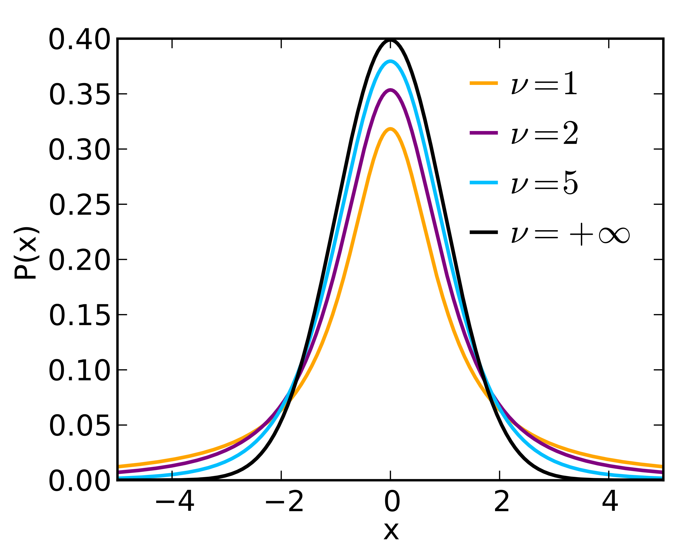
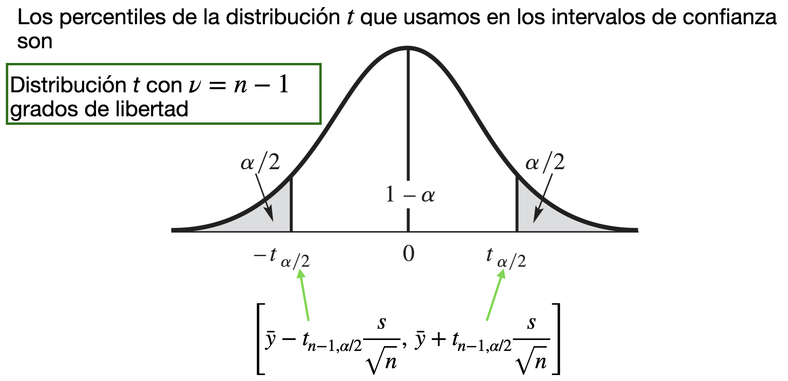
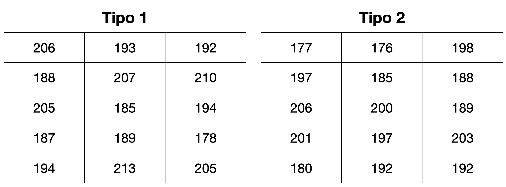

## Agenda

</br>

- Introducción

- Estimadores de intervalos

- Intervalos de confianza para la diferencia de medias

## Carguemos las librerías

</br></br></br>

Antes de empezar, carguemos las librerías que usaremos hoy.

```{python}
#| echo: true
#| output: true

import pandas as pd
import matplotlib.pyplot as plt
import seaborn as sns
from scipy.stats import ttest_1samp, ttest_ind
```

En el cógido de arriba, indicamos que utilizaremos la función `ttest_1samp()` y `ttest_ind()` de la librería **scipy.stats**.

# Introducción

## Introducción

</br></br>

El **objetivo** de la estadística es utilizar la información contenida en una muestra para hacer inferencias sobre la población o distribución de la que se toma la muestra.

</br>

Debido a que las distribuciones se caracterizan por sus parámetros, el objetivo de muchas investigaciones estadísticas es [***estimar***]{style="color: #4682B4"} el valor de uno o más parámetros relevantes.

## Por ejemplo ...

[**Problema 1**]{style="color: darkgreen"}: Estimar el peso promedio de un componente electrónico para ver si cumple con especificaciones de calidad.

. . .

[Solución]{.underline}:

:::: incremental
::: {style="font-size: 90%;"}
1.  [**Suponemos**]{style="color: pink"} que el peso de los componentes sigue una [***distribución*** $N(\mu, \sigma^2)$]{style="color: pink"}. Entonces, $\mu$ es el verdadero peso promedio de todos los componentes que pueden existir.

2.  Recolectamos una muestra de pesos de $n$ componentes seleccionados al azar. Los pesos son observaciones (de variables aleatorias): $y_1, y_2, \ldots, y_n$.

3.  Luego, usamos la muestra para estimar el peso promedio $\mu$ (o incluso $\sigma^2$).
:::
::::

## 

[**Problema 2**]{style="color: darkgreen"}: Calcular la proporción de componentes electrónicos que fallan.

. . .

[Solución]{.underline}:

:::: incremental
::: {style="font-size: 90%;"}
1.  [**Suponemos**]{style="color: pink"} que la proporción de componentes electrónicos que fallan sigue una [***distribución*** $\text{Bin}(n, p)$]{style="color: pink"}. Entonces, $p$ es la verdadera proporción de que componentes que fallan de entre todos los componentes que se pueden producir.

2.  Probamos $n$ componentes seleccionados al azar y vemos si fallan o no. Las fallas de los componentes son observaciones de variables aleatorias Bernoulli: $y_1, y_2, \ldots, y_n$, donde $y_i = 1$ si el *i*-ésimo componente falló y $y_i = 0$ si no falló.

3.  Luego, usamos la muestra para estimar $p$.
:::
::::

## Tipos de estimadores

</br></br>

Un **estimador** es una función de la muestra que provee información sobre un parametro de una distribución.

. . .

Hay dos tipos de estimadores:

- [***Estimador Puntual***]{style="color: darkblue"}: Un resúmen estadístico de la muestra.

- [***Estimador de Intervalo***]{style="color: darkgreen"}: Un par de cantidades $L$ and $U$ calculadas sobre una muestra donde $L \leq U$.

## Aplicación

</br>

Supongamos que deseamos estimar el tiempo promedio de ensamblaje por unidad $\mu$ de una nueva máquina de ensamble automatizada en una línea de producción.

Esta métrica es fundamental para evaluar la eficiencia del proceso y planificar la capacidad de producción.

Supongamos que hemos observado una muestra aleatoria de 10 unidades producidas por esta máquina, $y_1, y_2, \ldots, y_{10}$.

## 

</br></br>

Podemos utilizar la muestra aleatoria para construir dos estimaciones:

::: incremental
- [Estimación puntual]{style="color: darkblue"}: un solo número que es 42.8 segundos por unidad.

- [Estimación de intervalo]{style="color: darkgreen"}: El intervalo (40.2, 45.4) segundos que tiene una alta "confianza" de incluir el valor verdadero de $\mu$.
:::

# Estimadores de intervalos

## Estimador de intervalo

</br>

Un [***estimador de intervalo***]{style="color: darkgreen"} es un método para utilizar las observaciones de la muestra para calcular dos números que forman los puntos finales de un intervalo.

. . .

Idealmente, el intervalo tiene dos propiedades:

- Contiene el parámetro bajo estudio $\mu$.

- Es relativamente pequeño.

. . .

Los estimadores de intervalos se denominan comúnmente [***intervalos de confianza***]{style="color: #4682B4"}.

## Estructura de los estimadores de intervalo

</br>

Los estimadores de intervalo tienen la forma $[L,U]$ o $L \leq \mu \leq U$; donde:

- $L$ es el límite de confianza inferior.
- $U$ es el límite de confianza superior.

Técnicamente, $L$ y $U$ son [***variables aleatorias***]{style="color: purple"} porque son funciones de la muestra aleatoria.

## Intervalo de confianza para la media

</br></br>

Considera una muestra pequeña de observaciones $y_1, \ldots, y_n$, donde se [asume que se obtuvieron]{.underline} de una distribución [$N(\mu, \sigma^2)$]{style="color: red"}. Un [intervalo de confianza para $\mu$]{style="color: #4682B4"} es

. . .

::: {style="font-size: 110%;"}
$$\left[\bar{y} - t_{n-1, \alpha/2} \frac{s}{\sqrt{n}},~ \bar{y} + t_{n-1, \alpha/2} \frac{s}{\sqrt{n}} \right],$$
:::

## 

</br></br>

$$\left[\bar{y} - t_{n-1, \alpha/2} \frac{s}{\sqrt{n}},~ \bar{y} + t_{n-1, \alpha/2} \frac{s}{\sqrt{n}} \right],$$

- $\bar{y} = \frac{1}{n}\sum_{i=1}^n y_i$ es la media muestral donde $n$ es el numero de observaciones.
- $s =\sqrt{\frac{1}{n-1} \sum_{i=1}^{n} (y_i - \bar{y})^2}$ es la desviación estándar muestral.
- $t_{n-1, \alpha/2}$ es un [*percentil*]{style="color: green"} de la distribución $t$.

## La distribución $t$

::::::: columns
:::: {.column width="55%"}
::: {style="font-size: 90%;"}
La distribución $t$ es una distribución de probabilidad que surge en el contexto de la inferencia estadística.

Sus características principales:

- Tiene forma de campana.
- Su forma depende un parametro $\nu$ llamado “grados de libertad”.
- Cuando el valor de este parámetro es muy grande, la distribución $t$ converge a la $N(0,1)$.
:::
::::

:::: {.column width="45%"}
{fig-align="center"}

::: {style="font-size: 50%;"}
<https://en.wikipedia.org/wiki/Student%27s_t-distribution>
:::
::::
:::::::

## Percentiles de una distribución $t$

{fig-align="center"}

## ¿Como seleccionamos el valor de $\alpha$?

</br>

$$\left[\bar{y} - t_{n-1, \alpha/2} \frac{s}{\sqrt{n}},~ \bar{y} + t_{n-1, \alpha/2} \frac{s}{\sqrt{n}} \right]$$

El valor de $1-\alpha$ define el [**nivel de confianza**]{style="color: purple"} (o [*cobertura*]{style="color: purple"}) del intervalo de confianza.

Usualmente, el valor de $\alpha$ es 0.1, 0.05, o 0.01, lo cual resulta en intervalos con un nivel de confianza de 90%, 95%, y 99%, respectivamente.

## Definición formal de un IC

</br>

Debido a que $L$ y $U$ son aleatorios, un intervalo de confianza debe de tener una alta [*probabilidad de covertura*]{style="color: pink"} de contener el valor verdadero de $\mu$.

. . .

Matemáticamente, expresamos esto como

::: {style="font-size: 95%;"}
$$P\left(\bar{y} - t_{n-1, \alpha/2} \frac{s}{\sqrt{n}} \leq \mu \leq  \bar{y} + t_{n-1, \alpha/2} \frac{s}{\sqrt{n}} \right) = 1 - \alpha,$$
:::

Donde la probailidad $(1-\alpha)$ es el [*nivel de confianza*]{style="color: darkgreen"}.

## Interpretación de un IC

</br></br>

::: {style="font-size: 95%;"}
$$P\left(\bar{y} - t_{n-1, \alpha/2} \frac{s}{\sqrt{n}} \leq \mu \leq  \bar{y} + t_{n-1, \alpha/2} \frac{s}{\sqrt{n}} \right) = 1 - \alpha,$$
:::

[***Interpretación***]{style="color: pink"}: Si, en el muestreo aleatorio repetido, construimos **muchos** intervalos de confianza $[L, U]$, $100(1-\alpha)$% de ellos incluirán el verdadero valor de $\mu$.

## Más sobre niveles de confianza

::: incremental
- El nivel de confianza de un intervalo mide la confiabilidad del método utilizado para calcular el intervalo.

- Un nivel confianza $100(1-\alpha)\%$ es aquel calculado mediante un método que a largo plazo logrará [*cubrir*]{style="color: purple"} la media poblacional una proporción $1-\alpha$ de todas las veces que se utiliza.

- En la práctica, debemos de fijar el valor de $\alpha$. Entre más pequeño el valor de $\alpha$, más grande la confianza y el tamaño del intervalo.

- Los intervalos con mayor confianza son menos precisos.
:::

## Ejemplo 1

</br></br>

Un modelo de transferencia de calor desde un cilindro sumergido en un líquido predice que el coeficiente de transferencia de calor del cilindro se volverá constante a caudales de fluido muy bajos. Se toma una muestra de 10 medidas. Los resultados, en $W/m^2 K$, son

13.7, 12.0, 13.1, 14.1, 13.1, 14.1, 14.4, 12.2, 11.9, 11.8

Encuentra un intervalo de confianza del 95% para el coeficiente de transferencia de calor.

## Intervalos de confianza en Python

Primero, leamos los datos que están en el archivo "Cilindro.xlsx".

```{python}
#| echo: true

cilinder_data = pd.read_excel("Cilindro.xlsx")
cilinder_data.head()
```

## Visualización simple a través de un histograma

```{python}
#| echo: true
#| output: true
#| fig-align: center
#| code-fold: true

plt.figure(figsize=(7,4)) # Crea espacio para la figura.
sns.histplot(data = cilinder_data, x = 'Coeficiente') # Crea el histograma.
plt.title("Histograma de Coeficiente") # Título de la gráfica.
plt.xlabel("Coeficiente") # Etiqueta del eje X
plt.show() # Muestra la Gráfica
```

## Intervalo de confianza

</br>

Para construir un intervalo de confianza de una muestra, seguimos dos pasos.

</br>

Primero, realizamos una prueba de hipótesis (más detalles en la siguiente clase) usando la función `ttest_ind()` de **scipy.stats**.

```{python}
#| echo: true
#| output: true

prueba_hip = ttest_1samp(cilinder_data, popmean = 0)
```

Por convención, el parámetro `popmean` debe estar fijado en cero.

## 

</br></br>

Segundo, aplicamos la función `.confidence_interval()` al objeto anterior (`prueba_hip`) para obtener el intervalo de confianza. En está función, especificamos el nivel de confianza usando el parámetro `confidence_level`.

```{python}
#| echo: true
#| output: true

ci = prueba_hip.confidence_interval(confidence_level = 0.95)
ci
```

</br>

El intervalo de confianza del 95% es $[12.32, 13.76]$ o $12.32 \leq \mu \leq 13.76$

# Intervalos de confianza para la diferencia de medias

## Ejemplo 2

</br></br>

- Una ingeniera investiga la temperatura de deflexión bajo carga de dos tipos diferentes de tubos de plástico.

- La ingeniera tomó una muestra de 15 ejemplares de cada uno de los dos tipos de tubos.

- Ella midió las temperaturas observadas para los 30 tubos en grados Farenheit.

## 

{fig-align="center"}

- La ingeniera quiere investigar la diferencia entre la temperatura promedio de los dos tubos.

- Es decir, le interesa saber $\mu_2 - \mu_1$ donde $\mu_1$ y $\mu_2$ es la temperatura promedio del tubo tipo 1 y 2, respectivamente.

## 

</br></br>

- Si $\mu_2 - \mu_1 > 0$, entonces el tubo de tipo 2 tiene una temperatura promedio de deflexión más alta que el tubo de tipo 1.

- Si $\mu_2 - \mu_1 < 0$, entonces el tubo de tipo 1 tiene una temperatura promedio de deflexión más alta que el tubo de tipo 2.

- Si $\mu_2 - \mu_1 = 0$, entonces los tubos de tipo 1 y 2 tienen la misma temperatura promedio de deflexión.

## ¿Cómo podemos estimar el valor de $\mu_2 - \mu_1$?

::: {style="font-size: 95%;"}
- Utilizando un intervalo de confianza sobre $\mu_2 - \mu_1$.

- Si el intervalo de confianza contiene puros valores positivos, entonces tenemos una gran *confianza* que $\mu_2 - \mu_1 > 0$.

- Si el intervalo de confianza contiene puros valores negativos, entonces tenemos una gran *confianza* que $\mu_2 - \mu_1 < 0$.

- Si el intervalo de confianza contiene valores positivos y negativos, entonces no podemos asegurar que $\mu_2 - \mu_1 > 0$ o $\mu_2 - \mu_1 < 0$. En este caso, podriamos considerar que $\mu_2 - \mu_1 = 0$.
:::

## IC para la diferencia de dos medias

</br></br>

Recuerda que si la muestra aleatoria $Y_1, \ldots, Y_{n_y}$ sigue una distribución $N(\mu_y, \sigma_{y}^2)$, entonces $\bar{Y} \sim N\left(\mu_y, \frac{\sigma_{y}^2}{n_y}\right)$.

</br>

Además, si la muestra aleatoria $X_1, \ldots, X_{n_x}$ sigue una distribución $N(\mu_x, \sigma_{x}^2)$, entonces $\bar{X} \sim N\left(\mu_x, \frac{\sigma_{x}^2}{n_x}\right)$.

## El esquema

</br>

Para definir los intervalos de confianza, necesitamos definir lo siguiente:

Para la primera muestra de observaciones $y_1, y_2, \ldots, y_{n_y}$:

- $n_y$ es el número de observaciones.
- $\bar{y} = \frac{1}{n_y}\sum_{i=1}^{n_y} y_i$ es la media muestral.
- $s^2_y =\frac{1}{n_y-1} \sum_{i=1}^{n_y} (y_i - \bar{y})^2$ es la varianza muestral.

## 

</br></br></br>

Para la segunda muestra de observaciones $x_1, x_2, \ldots, x_{n_x}$:

- $n_x$ es el número de observaciones.
- $\bar{x} = \frac{1}{n_x}\sum_{i=1}^{n_x} x_i$ es la media muestral.
- $s^2_{x} =\frac{1}{n_x -1} \sum_{i=1}^{n_x} (x_i - \bar{x})^2$ es la varianza muestral.

## 

</br>

Si las dos muestras son independientes, un [intervalo de confianza de nivel $100(1-\alpha)\%$ para $\mu_y - \mu_x$]{style="color: #4682B4"} es

$$\left[ (\bar{y} - \bar{x}) - \text{ME}, (\bar{y} - \bar{x}) + \text{ME} \right] $$

donde ME es el *margen de error*.

Existen dos valores posibles para ME según los casos:

- Las varianzas téoricas de las distribuciones son iguales ($\sigma_y^{2} = \sigma_x^{2}$).
- Las varianzas téoricas de las distribuciones **no** son iguales ($\sigma_y^{2} \neq \sigma_x^{2}$).

## 

Si las distribuciones tienen la **misma varianza**, un [intervalo de confianza de nivel $100(1-\alpha)\%$ para $\mu_y - \mu_x$]{style="color: #4682B4"} es

::: {style="font-size: 70%;"}
$$\left[ (\bar{y} - \bar{x}) - t_{n_y + n_x - 2, \alpha/2}\cdot s_p\sqrt{\frac{1}{n_y} + \frac{1}{n_x}}, \; (\bar{y} - \bar{x}) + t_{n_y + n_x - 2, \alpha/2}\cdot s_p \sqrt{\frac{1}{n_y} + \frac{1}{n_x}} \right].$$
:::

</br>

La cantidad $s_p$ se llama [*desviación estándar agrupada*]{style="color: purple"}

$$s_p = \sqrt{ \frac{ (n_y - 1)s^2_{x} + (n_x - 1)s^2_{y} }{n_y + n_x - 2} }.$$

## 

Si las distribuciones tienen **differentes varianzas**, un [intervalo de confianza de nivel $100(1-\alpha)\%$ para $\mu_y - \mu_x$]{style="color: #4682B4"} es

::: {style="font-size: 90%;"}
$$\left[(\bar{y} - \bar{x}) - t_{\nu, \alpha/2} \sqrt{\frac{s_{y}^2}{n_y} + \frac{s_{x}^2}{n_x}}, \; (\bar{y} - \bar{x}) - t_{\nu, \alpha/2} \sqrt{\frac{s_{y}^2}{n_y} + \frac{s_{x}^2}{n_x}} \right].$$
:::

donde el número de grados de libertad viene dado por el valor $\nu = \frac{\left( \frac{s_y^2}{n_y} + \frac{s_x^2}{n_x} \right)^2 }{ \frac{ \left(s_{y}^2/n_y\right)^2}{n_y - 1} + \frac{ \left (s_{x}^2/n_x \right)^2}{n_x - 1} }$ (redondeado al número entero más cercano).

## En Python

Antes de empezar, carguemos los datos que están en el archivo "Tubos.xlsx"

```{python}
#| echo: true
#| output: true

tube_data = pd.read_excel("Tubos.xlsx")
tube_data.head()
```

## Cuidado!

La variable `Tubos` es [**categorica**]{style="color: red"}! Entonces, debemos de informar a Python sobre esto usando la función `pd.Categorical()`.

```{python}
#| echo: true
#| output: true

tube_data['Tipo'] = pd.Categorical(tube_data['Tipo'])
```

Veamos el resultado:

```{python}
#| echo: true
#| output: true

tube_data.info()
```

## Visualización

Podemos visualizar los datos de los dos grupos definidos por los tubos del tipo 1 y 2 usando gráficas de cajas lado a lado.

```{python}
#| echo: true
#| output: true
#| fig-align: center
#| code-fold: true

plt.figure(figsize=(7,4)) # Create space for the figure.
sns.boxplot(data = tube_data, y = 'Temperatura', x = 'Tipo') 
plt.ylabel("Temperatura") 
plt.xlabel("Tipo de tubo") 
plt.show() # Show the plot.
```

## Configuración

Un problema con los datos actuales es que no están en el formato requerido para la función de Python que construye intervalos de confianza. Está función necesita que los datos de los dos grupos estén en dos columnas separadas.

Sin embargo, podemos crear las dos columnas con nuestras funciones de **pandas**.

```{python}
#| echo: true
#| output: true

Temp_Tubo1 = (tube_data
  .query("Tipo == 1")
  .filter(['Temperatura'])
)
```

```{python}
#| echo: true
#| output: true

Temp_Tubo2 = (tube_data
  .query("Tipo == 2")
  .filter(['Temperatura'])
)
```

## Intervalo de confianza

</br></br>

Ahora, construímos el intervalo de confianza en dos pasos.

Primero, realizamos una prueba de hipótesis de dos muestras (más detalles en la siguiente clase) usando la función `ttest_ind()` de **scipy.stats**.

```{python}
#| echo: true
#| output: true

prueba_hip = ttest_ind(Temp_Tubo1, Temp_Tubo2, equal_var = False)
```

El parámetro `equal_var` en esta función indica si asumimos que las varianzas son iguales o diferentes. Asumamos que son diferentes.

## 

</br></br>

Segundo, aplicamos la función `.confidence_interval()` al objeto anterior (`prueba_hip`) para obtener el intervalo de confianza.

```{python}
#| echo: true
#| output: true

ci = prueba_hip.confidence_interval(confidence_level = 0.95)
ci
```

</br>

El intervalo es $[-3.12, 11.79]$ o $-3.12 \leq \mu_2 - \mu_1  \leq 11.79$.

## No asumas que las varianzas son iguales...

</br>

- El supuesto de que las varianzas teóricas de las distribuciones son iguales es muy estricto.

- El método puede resultar poco fiable si se utiliza cuando las varianzas teóricas no son iguales.

- Como normalmente no conocemos las varianzas, suele ser imposible estar seguro de que sean iguales.

## 

</br></br>

- Cuando las varianzas de la muestra son casi iguales, es tentador suponer que las varianzas de la población también lo son.

- Sin embargo, con tamaños de muestra pequeños, las varianzas de la muestra pueden no aproximarse bien a las varianzas teóricas de la distribución.

- **Solución**: La mejor práctica es asumir que las varianzas son desiguales a menos que esté bastante seguro de que son iguales.

## Preguntas de práctica para examen

La resistencia a la rotura de los ejes de los palos de hockey fabricados con dos compuestos diferentes de grafito arroja los siguientes resultados (en newtons):

- **R**: 487.3, 444.5, 467.7, 456.3, 449.7, 459.2, 478.9, 461.5, 477.2.

- **B**: 488.5, 501.2, 475.3, 467.2, 462.5, 499.7, 470.0, 469.5, 481.5, 485.2, 509.3, 479.3, 478.3, 491.5.

Encuentra un intervalo de confianza del 98% para la diferencia entre las resistencias medias a la rotura de los ejes de palos de hockey fabricados con los dos materiales.

# [Return to main page](https://alanrvazquez.github.io/TEC-IN2032/)
