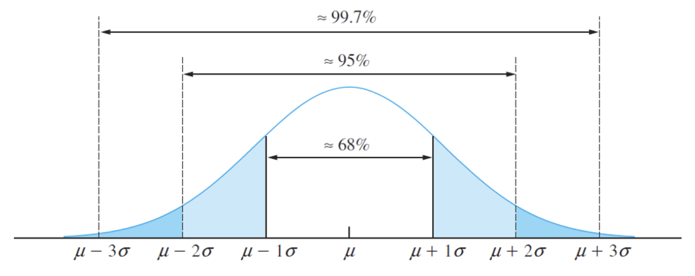
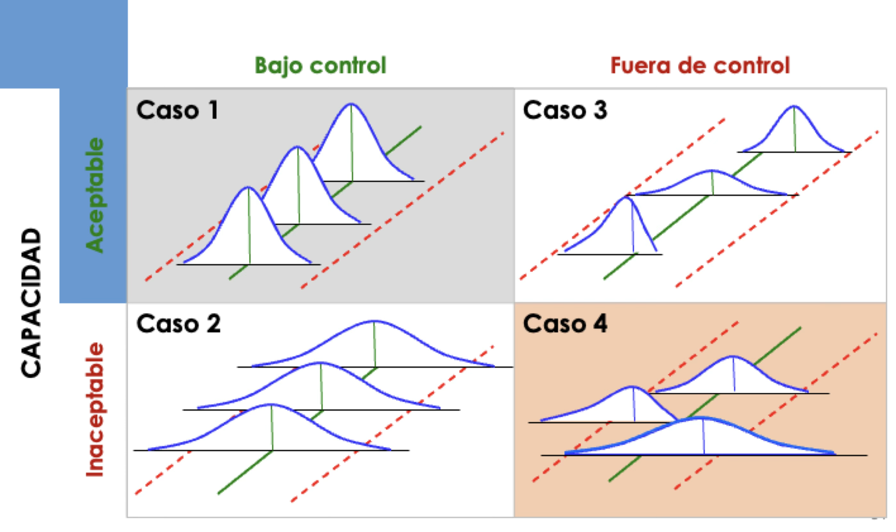
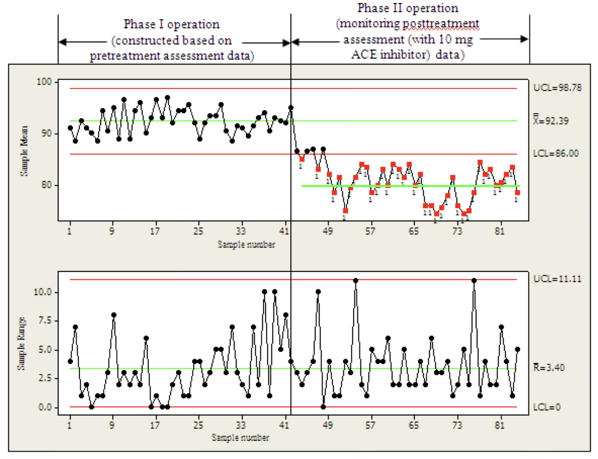

## Agenda

</br>

- Gráficas para Variables Numéricas

- Gráficas para Variables Discretas

## Carguemos las librerías

</br></br></br>

Antes de empezar, carguemos las librerías que usaremos hoy.

```{python}
#| echo: true
#| output: true

import pandas as pd
import matplotlib.pyplot as plt
import seaborn as sns
from scipy.stats import ttest_1samp, ttest_ind
```

En el cógido de arriba, indicamos que utilizaremos la función `ttest_1samp()` y `ttest_ind()` de la librería **scipy.stats**.

# Gráficas para variables numéricas

## Idea básica: Usa la Regla Empirica

{fig-align="center"}

::: {style="font-size: 80%;"}
Para una distribución normal:

Alrededor del 68% de la población se encuentra en el intervalo $[\mu - \sigma, \; \mu + \sigma]$.

Aproximadamente el 95% de la población se encuentra en el intervalo $[\mu - 2\sigma, \; \mu + 2\sigma]$.

Aproximadamente el 99.7% de la población se encuentra en el intervalo $[\mu - 3\sigma, \; \mu + 3\sigma]$.
:::

## 

</br>

Si un proceso esta bajo control, entonces el 99.7% de los valores de la catacterística de calidad del producto deben de estar entre $\mu \pm 3 \sigma$.

Observaciones que están fuera de esos límites indica que el proceso esta fuera de control. Es decir, que su [media]{style="color: #4682B4"} no es $\mu$.

Un reto en esto es que los valores de $\mu$ y $\sigma$ no se conocen. Además, que [la variabilidad del proceso podría no estar bajo control]{style="color: darkgreen"}.

Las gráficas de control proveen de métodos para estimar $\mu$ y $\sigma$ usando grupos de 1 o más observaciones que son recolectadas a través del tiempo.

## Clasificación de procesos

{fig-align="center"}

## Normalidad es relevante

La regla empírica implica que los datos utilizados en la gráfica de control deben de seguir una distribución normal. Para probar normalidad, utilizamos la prueba de Shapiro-Wilk:

::: {style="text-align: center;"}
$H_0$: Los datos siguen una distribución normal

Contra

$H_1$: Los datos no siguen una distribución normal
:::

Si el valor *p* de la prueba es pequeño (digamos, menor que 0.05), rechazamos $H_0$ y concluimos que los datos no siguen una distribución normal. De lo contrario, concluimos que los datos siguen una distribución normal. Mas adelante veremos como hacer esto en Python.

## Gráficas de control para variables numéricas

</br></br>

Nos enfocaremos en las siguientes gráficas de control.

- Gráfico de promedios-rangos ($\bar{X}$ y $R$) para subgrupos de 8 o menos observaciones.

- Gráfico I-MR para valores individuales (o subgrupos de tamaño 1).

## Gráfica de promedios y rangos

</br>

La gráfica de promedios y rangos (y también la gráfica I-MR) consisten de dos elementos:

1.  El valor medio (promedio) de una característica de calidad (gráfica $\bar{X}$). [Esta gráfica monitorea si la **media** está bajo control.]{style="color: #4682B4"}

2.  La variabilidad de la característica de calidad (gráfica $R$). [Esta gráfica monitorea si la **variabilidad** está bajo control]{style="color: #5E7D6A"}.

[Se asume que los ***promedios de los subgrupos*** siguen una distribución normal.]{style="color: darkred"}

## Notación perliminar

Recuerda que hay $k$ subgrupos con $n$ observaciones cada uno. Las observaciones del *i*-ésimo subgrupo se denotan como $x_{i1}, x_{i2}, \ldots, x_{in}$, donde $i = 1, \ldots, k.$.

</br>

- El promedio del *i*-ésimo grupo es $\bar{X}_i = \frac{x_{i1} + x_{i2} + \cdots + x_{in}}{n}$.

- El rango del *i*-ésimo grupo es $R_i = \max{(x_{i1},x_{i2}, \ldots, x_{in})} - \min{(x_{i1},x_{i2}, \ldots, x_{in})}$.

- El gran promedio $\bar{\bar{X}} = \frac{\bar{X}_1 + \bar{X}_2 + \cdots + \bar{X}_k}{k}$.

- El rango promedio $\bar{R} = \frac{R_1 + R_2 + \cdots + R_k}{k}$.

## Gráfica $\bar{X}$

Los elementos de la gráfica $\bar{X}$ son:

- La línea central de la gráfica está dada por $\bar{\bar{X}}$.

- El límite de control superior es: $\bar{\bar{X}} + A_2 \bar{R}$.

- El límite de control inferior es: $\bar{\bar{X}} - A_2 \bar{R}$.

. . . 

Donde $A_2$ es una constante que se obtiene de tablas especiales dependiendo del tamaño del subgrupo ($n$).

Técnicamente, la constante $A_2$ hace que $A_2 \bar{R}$ sea un buen estimador de $3\sigma$ en la regla empírica.

## Gráfica $R$

</br>

Los elementos de la gráfica $R$ son:

- La línea central de la gráfica está dada por $\bar{R}$.

- El límite de control superior es: $D_4 \bar{R}$.

- El límite de control inferior es: $D_3 \bar{R}$.

. . . 

Donde $D_3$ y $D_4$ son constantes que se obtienen de tablas especiales y dependen del tamaño del subgrupo ($n$). Estas constantes aseguran que los límites tengan propiedades deseables.

## 

| **Tamaño de subgrupo (**$n$) | $A_2$ | $D_3$ | $D_4$ |
|------------------------------|-------|-------|-------|
| 2                            | 1.880 | 0     | 3.267 |
| 3                            | 1.023 | 0     | 2.574 |
| 4                            | 0.729 | 0     | 2.282 |
| 5                            | 0.577 | 0     | 2.114 |
| 6                            | 0.483 | 0     | 2.004 |
| 7                            | 0.419 | 0.076 | 1.924 |
| 8                            | 0.373 | 0.136 | 1.864 |
| 9                            | 0.337 | 0.184 | 1.816 |
| 10                           | 0.308 | 0.223 | 1.777 |

## Ejemplo 1

</br>

La fuerza de tracción de un cable conectado a un circuito integrado está bajo monitoreo.

Un ingeniero recopilo la fuerza de tracción de 20 subgrupos de cables tomados a través del tiempo. Cada subgrupo contiene 3 cables.

El archivo “Pull_Strength.xlsx” contiene los datos.

A)  Construye las gráficas $\bar{X}$ y $R$.

B)  Encuentra los puntos que están fuera de control.

## Construyendo gráficas de control en Python

Carguemos los datos que están en el archivo "Pull_Strength.xlsx"

```{python}
#| echo: true
#| output: true

pull_data = pd.read_excel("Pull_Strength.xlsx")
pull_data.head()
```

## Cuidado!

La variable `Subgrupo` es [**categorica**]{style="color: red"}! Entonces, debemos de informar a Python sobre esto usando la función `pd.Categorical()`.

```{python}
#| echo: true
#| output: true

pull_data['Subgrupo'] = pd.Categorical(pull_data['Subgrupo'])
```

Veamos el resultado:

```{python}
#| echo: true
#| output: true

pull_data.info()
```

## 

## Evaluando la normalidad de los promedios en Python

## Gráfica de valores individuales

En muchas situaciones, los subgrupos constan de una observacion ($n=1$). Por ejemplo:

::: {style="font-size: 85%;"}
- Se usa la tecnología de inspección y medición automatizada, y se analiza cada unidad fabricada.

- La rapidez con que se saca la producción es muy lenta.

- Las mediciones repetidas del proceso tan solo difieren por el error de laboratorio o analisis.
:::

En estas situaciones, usamos la gráfica de control para mediciones individuales. [Aquí, se asume que las observaciones individuales siguen una distribución normal.]{style="color: darkred"}

## Notación

</br></br>

En este caso, hay $n=1$ observación en cada uno de los $k$ subgrupos.

Podemos usar una notación más simple para las observaciones de cada subgrupo: $x_{1}, x_{2}, \ldots, x_{k}$, donde $x_i$ es la observación del i-ésimo grupo.

- El gran promedio es $\bar{X} = \frac{x_1 + x_2 + \cdots + x_k}{k}$.

## Rango móvil

</br>

La gráfica de mediciones individuales usa el **rango móvil** de dos observaciones sucesivas para estimar la variabilidad del proceso.

El rango móvil del i-ésimo grupo se define como $MR_i = |x_i - x_{i-1}|$. Es decir, la diferencia absoluta entre la observación actual y la anterior.

El rango móvil promedio es $\bar{MR} = \frac{MR_1 + MR_2 + \cdots + MR_{k-1}}{k - 1}$.

## Gráfica $\bar{X}$ (versión individual)

</br>

Los elementos de la gráfica $\bar{X}$ individual son:

- La línea central de la gráfica está dada por $\bar{X}$.

- El límite de control superior es: $\bar{X} + 3 \frac{\bar{MR}}{1.128}$.

- El límite de control inferior es: $\bar{X} - 3 \frac{\bar{MR}}{1.128}$.

Donde el 1.128 se obtiene de tablas especiales.

## Gráfica $R$ (versión individual)

</br>

Los elementos de la gráfica $R$ individual son:

- La línea central de la gráfica está dada por $\bar{MR}$

- El límite de control superior es: $3.267\bar{MR}$.

- El límite de control inferior es: $0$.

Donde el 0 y 3.267 son constantes que se obtienen de tablas especiales.

## Ejemplo 2

</br></br>

La viscosidad de un producto químico se mide cada hora. Veinte muestras cada una de tamaño 1 se encuentran en el archivo “Viscosity.xlsx.”

A)  Utilizando todos los datos, calcula los límites de control de observaciones individuales y gráficos de rangos móviles.

B)  Encuentre las muestras que están fuera de control. Reproduce el gráfico de control sin esas muestras.

## Western Electric Rules

Cualquiera de las siguientes condiciones es evidencia de que un proceso está fuera de control:

::: {style="font-size: 90%;"}
1.  Cualquier punto trazado fuera de los límites de control de $3\sigma$.

2.  Dos de tres puntos consecutivos que se trazan por encima del límite superior de $2\sigma$, o dos de tres puntos consecutivos se ubican por debajo del límite inferior de $2\sigma$.

3.  Cuatro de cinco puntos consecutivos que se trazan por encima del límite superior de $1\sigma$, o cuatro de cinco puntos consecutivos se ubican por debajo del límite inferior de $1\sigma$.

4.  Ocho puntos consecutivos trazados en el mismo lado de la línea central.
:::

## Discusión

Para subgrupos de una o más observaciones, se recomienda primero estudiar la carta $R$ porque si la variabilidad del proceso no es constante con el tiempo, los límites de control calculados para la carta $\bar{X}$ pueden llevar a conclusiones falsas.

Ten cuidado al interpretar la gráfica $R$ individual porque los rangos móviles están correlacionados. Esta correlación con frecuencia puede inducir un patrón de cambios o ciclos en la gráfica.

Las gráficas de valores individuales son mucho mejores para detectar cambios grandes. Para detectar cambios pequeños, la gráfica de *control de suma acumulada* es una mejor opción.

## Gráficas para variables categóricas

Las gráficas de control para variables categóricas son importantes por varias razones:

::: {style="font-size: 95%;"}
- Existen datos categóricos en cualquier situación técnica o administrativa

- Los datos categóricos generalmente están disponibles

- Los datos categóricos generalmente se obtiene de forma rápida y barata.

- La mayoría de los datos recabados en un informe para la Gerencia con frecuencia es en forma de datos categóricos (bueno o malo) y éste puede beneficiar el análisis de la gráfica de control
:::

## Tipos de defectos

**Defectivo** es cuando una unidad entera no logra el criterio de aceptación, independientemente del número de defectos en la unidad

**Un defecto** es el incumplimiento de uno de los criterios de aceptación. Una unidad defectuosa puede tener múltiples defectos.

El [**criterio de conformidad**]{style="color: #4682B4"} debe estar claramente definido así como los procedimientos para decidir si los criterios se cumplen para producir resultados consistentes sobre el tiempo

## Grafica *p*

::: {style="text-align: center;"}
**Evalúa la fracción o porcentaje de unidades defectuosas**
:::

Se utiliza en las siguientes situaciones:

- Decisiones Aceptar/Rechazar con tamaño de subgrupo constante (o variable):
  - Proporción de defectuosos
  - Proporción de artículos arriba (o abajo) de un valor nominal
  - Proporción de conformidad
- Decisiones de juicio:
  - Proporción de artículos dentro de una categoría especificada

## Notación

Recuerda que tenemos $k$ subgrupos y $n$ unidades en cada subgrupo.

- $n_i$ es el número de unidades defectuosas en el *i*-ésimo subgrupo.
- $p_i = n_i /n$ es la proporción de unidades defectuosas en el *i*-ésimo subgrupo.
- $n p_i$ es el número de unidades defectuosas en el *i*-ésimo subgrupo.
- El promedio de las proporciones es $\bar{p} = \frac{n p_1 + n p_2  + \cdots + n p_k}{nk}$.

## Gráfica *p*

</br>

Los elementos de la gráfica *p* son:

- La linea central de la gráfica está dada por $\bar{p}$.

- El límite de control superior es: $\bar{p} + 3 \sqrt{ \frac{\bar{p} (1- \bar{p})}{n}}$.

- El límite de control inferior es: $\bar{p} - 3 \sqrt{ \frac{\bar{p} (1- \bar{p})}{n}}$.

## Ejemplo 3

- El concentrado de jugo de naranja congelado se presenta en latas de cartón de 6 onzas.

- Estas latas se forman en una máquina girándolas a partir de cartón y colocándoles un panel inferior de metal.

- Al inspeccionar una lata, podemos determinar si, cuando está llena, podría tener fugas en la costura lateral o alrededor de la junta inferior.

- Tal lata no conforme tiene un sello inadecuado ya sea en la costura lateral o en el panel inferior.

## 

</br></br>

Hagamos una gráfica de control para mejorar la fracción de latas no conformes producidas por esta máquina.

Para establecer el gráfico de control, se seleccionaron 30 muestras de $n$ = 50 latas cada una a intervalos de media hora durante un período de tres turnos en los que la máquina estuvo en funcionamiento continuo.

Los datos están en el archivo de excel “Juice.xlsx”.

## En Python

## Gráfica *np*

::: {style="text-align: center;"}
**Evalúa el número de unidades defectuosas**
:::

Asume que el tamaño de los subgrupos es constante.

Los elementos de la gráfica *np* son:

- La linea central de la gráfica está dada por $\bar{np}$.
- El límite de control superior es: $n\bar{p} + 3 \sqrt{n \bar{p} (1- \bar{p})}$.
- El límite de control inferior es: $n\bar{p} - 3 \sqrt{n \bar{p} (1- \bar{p})}$.

## En Python

## Gráfica *p* contra Gráfica *np*

</br>

**Gráfica *p***:

- La gráfica *p* se utiliza cuando el tamaño de la muestra varía de subgrupo a subgrupo.

- Monitorea la proporción de unidades no conformes en una muestra.

- Es útil cuando el tamaño de la muestra es relativamente pequeño y variable.

- Se calcula como el número de unidades no conformes dividido por el tamaño de la muestra.

## 

</br></br>

**Gráfica *np***:

- La gráfica *np* se utiliza cuando el tamaño de la muestra permanece constante de subgrupo a subgrupo.

- Monitorea el número de unidades no conformes en una muestra, en lugar de la proporción.

- Se usa cuando el tamaño de la muestra es constante y relativamente grande.

- Representa directamente el número de unidades no conformes en cada muestra.

## Preguntas de práctica para examen

</br>

Cierto tipo de circuito integrado está conectado a su estructura mediante cinco cables.

Se tomaron treinta muestras de cinco unidades cada una y se midió la fuerza de tracción (en gramos) de un cable en cada unidad.

Los datos se presentan en el archivo “Cables_Circuito.xlsx” en Canvas.

1.  Crea la gráfica de control de promedios-rangos.

2.  ¿Está el proceso bajo control?

## 

Las gráficas que hemos visto en esta sección se conocen como gráficas de fase 1.

:::::: columns
:::: {.column width="60%"}
::: {style="font-size: 75%;"}
[**Gráficas de Fase 1**]{style="color: #FF00FF"} se usan para el análisis inicial del proceso. Su objetivo es evaluar la estabilidad del proceso determinando si está en un estado de control estadístico, es decir, si está operando consistentemente a lo largo del tiempo.

[**Gráficas de Fase 2**]{style="color: purple"} emplea después de que un proceso ha sido establecido como estable en la Fase I. Sirve para monitorear el rendimiento continuo del proceso y asegurarse de que permanezca en un estado de control estadístico, además de detectar cambios o desviaciones que puedan ocurrir con el tiempo.
:::
::::

::: {.column width="40%"}
</br>

{fig-align="center"}
:::
::::::

# [Return to main page](https://alanrvazquez.github.io/TEC-IN2032/)
