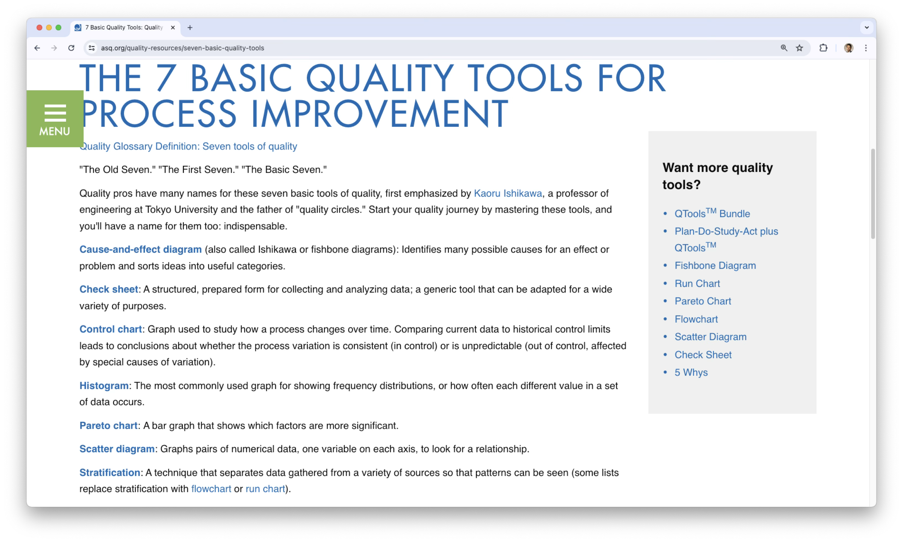
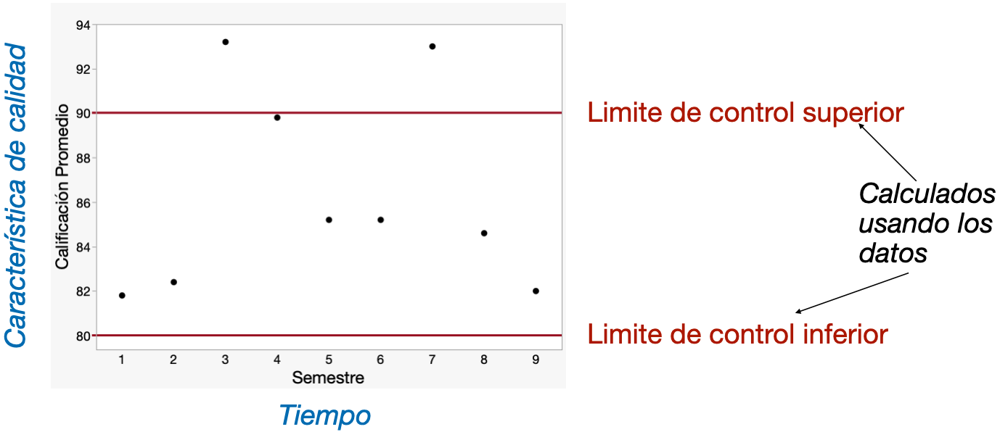
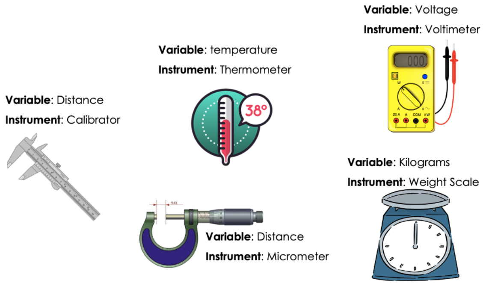
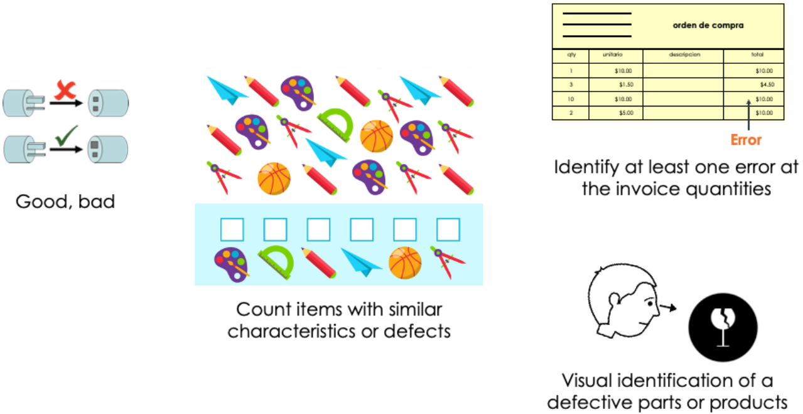
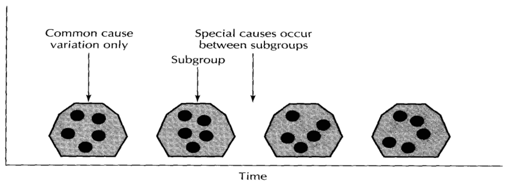
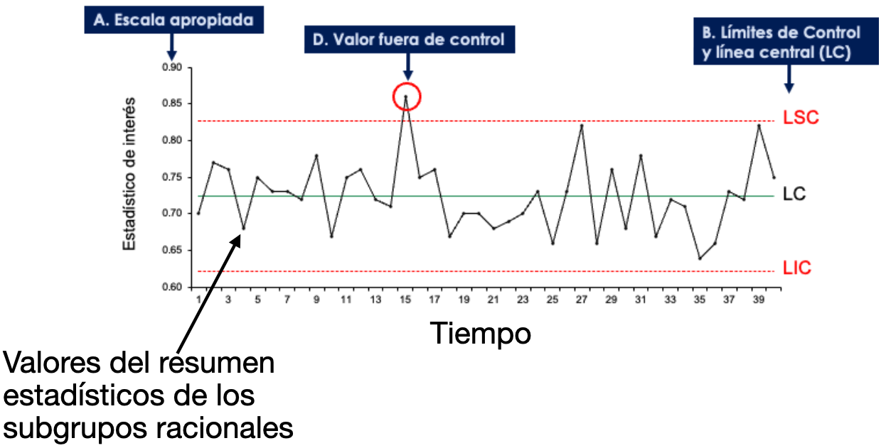

## Agenda

 

- Conceptos Básicos y Herramientas

- Introducción a las Gráficas de Control

## Control de Calidad

 

- El [**control de calidad**]{style="color:#587156"} es un conjunto de herramientas estadísticas para el mejoramiento de calidad.

::: incremental
- El mejoramiento de calidad significa eliminar el desperdicio sitemáticamente.

- Para lograr esto, podemos

  - **Reducir la variabilidad** del proceso de producción.
  - **Eliminar los defectos** de la unidad producida.
:::

## Monitoreo Estadístico de Procesos

Uno de los métodos más importantes en el control de calidad es el [***monitoreo estadístico de procesos*** (MEP)]{style="color: darkgreen"}.

:::: {style="font-size: 85%;"}
::: incremental
- La motivación del MEP es que no es práctico inspeccionar la calidad dentro de un producto: el producto debe de hacerse correctamente la primera vez.

- Entonces el proceso de fabricación debe de ser estable y tener la capacidad de operar con poca variabilidad.

- El monitoreo se realiza tomando muestras de la unidad de producción y midiendo alguna característica de calidad.
:::
::::

. . .

El MEP es una herramienta para reducir la variabilidad de un proceso sistemáticamente.

## Tipos de variabilidad

  

En cualquier proceso de producción, sin importar lo bien diseñado que esté o la atención que se preste a su mantenimiento, siempre existirá cierta [**variabilidad natural**]{style="color: orange"} o inherente.

 

A esta variabilidad natural es debido a [***causas aleatorias***]{style="color: orange"} del proceso, las cuales son una parte inherente del proceso.

## 

  

Por ejemplo

- Fluctuaciones pequeñas en un proceso de manufactura, variaciones pequeñas en tiempos de entrega, o variaciones pequeñas en el peso de dos productos idénticos. Todo esto debido a factores naturales o esperados.

[***Un proceso está bajo control estadístico cuando opera únicamente en presencia de causas aleatorias de variación.***]{style="color: #587156"}

## 

Existen otro tipo de variabilidad que pueden estar presente en la producción de un proceso. Esta variabilidad es ocasionada por [***causas asignables***]{style="color: darkred"}.

. . . 

Ejemplos de causas asignables son:

- Máquinas mal calibradas

- Errores del operador en el proceso

- Materias primas defectuosas

. . . 

[Cuando la variabilidad debido a causas asignables es mayor que la variabilidad natural, se dice que el proceso no está bajo control.]{style="color: purple"} Es decir, el proceso tiene un nivel inaceptable de desempeño.

## Herramientas del MEP

  

**El objetivo del MEP es detectar con rapidez la presencia de causas asignables del proceso**, para que pueda hacerse la investigación del proceso y aplicarse las acciones correctivas antes de que se fabriquen muchas unidades no conformes.

 

La [***gráfica de control***]{style="color: #4682B4"} es una técnica de monitoreo en linea para este fin. Es una de las 7 herramientas básicas de calidad.

## 

{fig-align="center"}

<https://asq.org/quality-resources/seven-basic-quality-tools>

# Introducción a las Gráficas de Control

## Gráficas de control

La [**gráficas de control**]{style="color: #4682B4"} nos ayudan a monitorear una característica de calidad de un producto. Dicha característica es la _**variable**_ bajo estudio.

Una gráfica de control:

:::: {style="font-size: 85%;"}
::: incremental
- puede estimar los parámetros de un proceso de producción y determinar la capacidad de un proceso para cumplir con las especifícaciones.

- Proporciona información útil sobre si la *variabilidad del proceso* es debido a **causas asignables** en el proceso.

- En esencia, es una prueba de hipótesis de que el proceso está en un estado de control estadístico.
:::
::::

## ¿Cómo se ve una gráfica de control?

Monitoreando las calificaciones durante los semestres de mi carrera

{fig-align="center"}

## 

 

Los **pasos para trabajar** con una gráfica de control son:

1.  Definir el tipo de gráfica dependiendo de la variable bajo estudio.

2.  Recolectar varias muestras (conjuntos) de observaciones durante un periodo de tiempo.

- Definir el número de observaciones en la muestra
- Seleccionar la frecuencia en que se recopilaran las muestras

3.  Construir e interpretar la gráfica.

## 1. El tipo de gráfica de control depende del tipo de variable

 

Recuerda que hay dos tipos de variables:

 

[**Variables numéricas (continuas)**]{style="color: darkblue"}:

- Pueden tomar muchos valores diferentes dentro de un rango.

- Por ejemplo, diámetro, peso, temperatura, nivel de ruido.

## 

   

[**Variables discretas (categóricas)**]{style="color: darkgreen"}:

- Pueden tomar un numero pequeño y entero de valores

- Por ejemplo, los defectos por unidad y las unidades defectuosas por lote.

## Mediciones sobre variables numéricas

{fig-align="center"}

## Mediciones sobre variables discretas

{fig-align="center"}

## Tipos de gráficas de control

  

Las gráficas de control comúnes para [**variables numéricas**]{style="color: darkblue"} son:

- Gráfico de promedios-rangos ($\bar{X}$ y $R$).
- Gráfico para valores individuales.

A estas gráficas también se les llama [***gráficas control para variables***]{style="color: #4682B4"}.

## 

   

Las gráficas de control más comúnes para [**variables categóricas**]{style="color: darkgreen"} son:

- Gráfica *p* para la proporción de defectos.

- Gráfica *np* para el número de unidades defectuosas.

A estas gráficas también se les llama [***gráficas control para atributos***]{style="color: #5E7D6A"}.

## Recolección de datos

Los datos para construir un gráfico de control se recopilan en varias muestras tomadas durante un período de tiempo. Estas muestras se denominan [**subgrupos racionales**]{style="color: orange"}.

El plan de muestreo de estos subgrupos tiene los siguientes elementos:

::: incremental
::: {style="font-size: 85%;"}
- **Número de subgrupos racionales** ($k$): debe seleccionar un número $k$ grande, normalmente 20 o más.

- **Tamaño del subgrupo** ($n$): la naturaleza de la variable de estudio te ayudará a definir el tamaño del subgrupo.

- **Frecuencia**: los subgrupos se toman secuencialmente en el tiempo.

- **Esquema de muestreo**: usualmente muestreo aleatorio.
:::
:::

## Creación de subgrupos racionales

Para crear subgrupos racionales, el **principio básico** a seguir es que toda la variabilidad dentro de las unidades de un subgrupo racional *debe deberse a causas aleatorias y ninguna a causas asignables*.

{fig-align="center"}

## 

  

Es decir, los subgrupos deberán seleccionarse tal que, en la medida de lo posible, la variabilidad de las observaciones dentro de un subgrupo deberá incluir toda la variabilidad natural y excluir la variabilidad por causes asignables.

 

Esto permitirá a la gráfica de control señalar puntos que se encuentran fuera de control.

## Métodos para generar subgrupos racionales

Existen dos métodos para generar subgrupos racionales:

1.  Los elementos de cada muestra son fabricados cerca del momento en que se realiza el muestreo.

::: {style="font-size: 90%;"}
- Detecta cambios en el proceso
- Minimiza la variabilidad debida a causas asignables dentro de una muestra, y maximiza la variabilidad entre las muestras en caso de que haya causas asignables presentes.
- Proporciona mejores estimaciones de la desivación estándar del proceso.
:::

## 

 

2.  Los elementos de cada muestra son seleccionados de todas las unidades producidas desde que se tomó la última muestra.

::: {style="font-size: 90%;"}
- En este caso, cada subgrupo es una muestra aleatoria de la producción total del proceso en el intervalo de muestreo.
- Permite tomar decisiones relativas a la aceptación de todas las unidades del producto que se han producido desde la última muestra.
- Es útil en situaciones donde el proceso se sale de control pero vuelve a el inmediatamente.
:::

## Comentarios

 

Idealmente, el plan de muestreo tiene:

- Mediciones de grupos que se toman frequentemente.
- Los subgrupos son grandes, lo cual facilita la detección de los cambios pequeños en el proceso.

Sin embargo, este tipo de muestreo tiende a ser muy costoso cuando la recopilación de datos se hace manualmente.

En estos casos, [*la práctica actual de la industria tiende a favorecer los registros frecuentes de subgrupos pequeños*]{style="color: #B2AC88"}.

## Registrar los datos

Una vez teniendo los subgrupos racionales, debemos de registrar mediciones sobre sus elementos. Estas mediciones formaran el conjunto de datos.

Para realizar las mediciones, necesitamos un [***instrumento de medición***]{style="color: darkgray"} y una ***persona que utiliza este instrumento***.

. . . 

Durante la medición, registra lo siguiente:

1.  Los valores individuales y la identificación de eventos (si aplica) para cada subgrupo.

2.  Cualquier observación relevante que pueda ayudarnos a explicar inconsistencias en el análisis.

## Características de un buen sistema de medición

:::: {style="font-size: 88%;"}
::: incremental
- Proporcionar resultados que se acerquen lo más posible al valor verdadero.

- Producir resultados consistentes cuando se mide el mismo objeto en las mismas condiciones.

- Ser reproducible en el sentido que se deben de obtener mediciones similares por otra persona usando el mismo u otro instrumento.

- Ser sensible para detectar cambios pequeños en el objeto medido.

- Tener un tiempo de respuesta rápido.

- Ser robusto en el sentido de ser capaz de mantener su precisión y fiabilidad incluso en condiciones adversas.
:::
::::

## Procesamiento de datos

  

Para generar la gráfica de control, se calculan resúmenes estadísticos de los datos de cada subgrupo. Estos resumenes pueden ser:

- Promedio o media

- Desviación estándar

- [**Rango**]{style="color: purple"}: la diferencia entre el máximo y el mínimo de los datos.

## Recapitulación

 

{fig-align="center"}

# [Return to main page](https://alanrvazquez.github.io/TEC-IN2032/)
